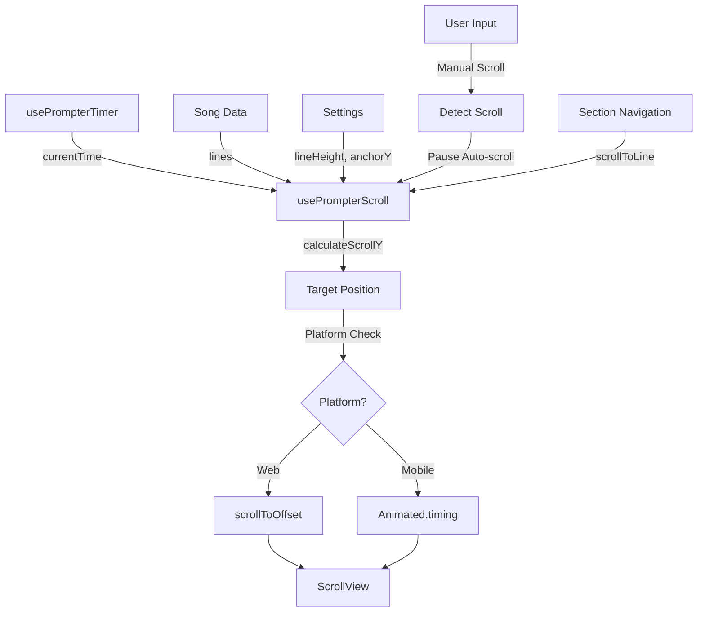

# Design Document - Prompter Scrolling Fix

## Overview

The teleprompter's automatic scrolling functionality is currently completely broken - the prompter does not scroll at all during playback. This is a critical issue as automatic scrolling is the core feature of a teleprompter application.

After analyzing the current implementation, the root cause has been identified: the code uses `react-native-reanimated`'s `scrollTo` function with an `AnimatedFlatList`, but there are several issues:

1. **FlatList scrolling limitation**: `scrollTo` from reanimated works with `ScrollView` but has limited support for `FlatList`
2. **Missing scroll handler**: The `useAnimatedScrollHandler` is defined but never connected to the FlatList
3. **Platform differences**: Web and mobile require different scrolling approaches
4. **Ref type mismatch**: Using `useAnimatedRef` with FlatList may not provide the correct ref type for scrolling

The fix will involve rewriting the scrolling mechanism while preserving all existing functionality (timing interpolation, section navigation, keyboard controls, pause/resume, etc.).

## Architecture

### Current Architecture (Broken)
```
usePrompterTimer (updates currentTime)
    ↓
useEffect (calculates targetScrollY via calculateScrollY)
    ↓
scrollTo(scrollViewRef, 0, targetScrollY, true) ← BROKEN
    ↓
AnimatedFlatList ← DOESN'T SCROLL
```

### Proposed Architecture (Fixed)
```
usePrompterTimer (updates currentTime)
    ↓
useEffect (calculates targetScrollY via calculateScrollY)
    ↓
Platform-specific scroll execution:
  - Web: scrollViewRef.current?.scrollToOffset({ offset: targetScrollY, animated: true })
  - Mobile: Animated.timing() with scrollY shared value
    ↓
AnimatedFlatList or AnimatedScrollView
```

## Components and Interfaces

### Core Components

#### 1. PrompterScreen (Modified)
The main prompter screen component that will be refactored to fix scrolling.

**Key Changes:**
- Replace `AnimatedFlatList` with `AnimatedScrollView` for better scroll control
- Implement platform-specific scrolling logic
- Add proper ref handling for scroll operations
- Maintain all existing features (keyboard controls, section navigation, etc.)

#### 2. usePrompterScroll (New Hook)
A custom hook to encapsulate scrolling logic and platform differences.

```typescript
interface UsePrompterScrollOptions {
  currentTime: number;
  lines: LyricLine[];
  lineHeight: number;
  anchorY: number;
  isPlaying: boolean;
}

interface UsePrompterScrollReturn {
  scrollViewRef: RefObject<ScrollView>;
  scrollY: SharedValue<number>;
  scrollToPosition: (position: number, animated: boolean) => void;
  scrollToLine: (lineIndex: number) => void;
}

function usePrompterScroll(options: UsePrompterScrollOptions): UsePrompterScrollReturn
```

**Responsibilities:**
- Calculate target scroll position using `calculateScrollY`
- Execute platform-specific scrolling
- Handle manual scroll detection and auto-scroll resume
- Provide utilities for section navigation

#### 3. calculateScrollY (Unchanged)
The existing scroll position calculation function remains unchanged as it's working correctly.

```typescript
export function calculateScrollY(params: ScrollCalculationParams): number
```

### Data Flow



## Data Models

No changes to existing data models. The fix uses existing types:

```typescript
// Existing types (unchanged)
interface LyricLine {
  id: string;
  text: string;
  timeSeconds?: number;
  section?: SongSection;
}

interface ScrollCalculationParams {
  currentTime: number;
  lines: LyricLine[];
  lineHeight: number;
  anchorY: number;
}
```

## Correctness Properties

*A property is a characteristic or behavior that should hold true across all valid executions of a system-essentially, a formal statement about what the system should do. Properties serve as the bridge between human-readable specifications and machine-verifiable correctness guarantees.*

### Property 1: Scroll position updates during playback
*For any* song with timing data and any time value during playback, when playback is active, the scroll position should be calculated and updated to match the current time.
**Validates: Requirements 1.1, 1.2**

### Property 2: Scroll position correctness
*For any* line with timing data, when the current time matches that line's time, the scroll position should position that line at the anchor point on screen.
**Validates: Requirements 1.4**

### Property 3: Smooth interpolation (continuity)
*For any* two time values t1 and t2 where |t2 - t1| is small, the difference in scroll positions |scrollY(t2) - scrollY(t1)| should also be small (continuous function, no jumps).
**Validates: Requirements 2.1**

### Property 4: Platform-appropriate scrolling
*For any* platform (web or mobile), the scroll execution should use the correct platform-specific API (scrollToOffset for web, Animated.timing for mobile).
**Validates: Requirements 2.2**

### Property 5: Manual scroll detection
*For any* manual scroll event during playback, the system should detect it and temporarily pause automatic scrolling, then resume after a delay.
**Validates: Requirements 2.4**

### Property 6: Pause maintains position
*For any* scroll position when playback is paused, the scroll position should remain unchanged until playback resumes or user manually scrolls.
**Validates: Requirements 3.1**

### Property 7: Resume continues from current time
*For any* paused state with a current time, when playback resumes, scrolling should continue from the scroll position corresponding to that time.
**Validates: Requirements 3.2**

### Property 8: Seek updates position
*For any* time position that the user seeks to, the scroll position should immediately update to the position corresponding to that time.
**Validates: Requirements 3.4**

### Property 9: Section navigation scrolls to section
*For any* section in a song, when the user navigates to that section, the scroll position should move to the first line of that section.
**Validates: Requirements 4.1**

### Property 10: Section navigation during playback
*For any* section navigation that occurs during playback, the time position should update to the section's start time and scrolling should continue from that position.
**Validates: Requirements 4.2**

### Property 11: Backward compatibility with timing data
*For any* existing song with timing data in the current format, the new scrolling implementation should produce the same scroll positions as the original algorithm.
**Validates: Requirements 5.5**

### Property 12: Interpolation algorithm preserved
*For any* set of timing anchors, the interpolation algorithm should produce the same interpolated times as before the scrolling fix.
**Validates: Requirements 6.2**

## Error Handling

### Scroll Execution Errors
- **Problem**: Platform-specific scroll API fails
- **Solution**: Log error, fall back to non-animated scroll, show user notification if persistent
- **Recovery**: Retry with non-animated scroll, allow manual scrolling

### Missing Timing Data
- **Problem**: Song has no timing data or incomplete timing data
- **Solution**: Use default behavior (even distribution based on duration)
- **Fallback**: Display static lyrics without auto-scroll, allow manual scrolling

### Invalid Scroll Position
- **Problem**: Calculated scroll position is negative or exceeds content height
- **Solution**: Clamp to valid range [0, maxScrollY]
- **Prevention**: Validate in calculateScrollY function

### Ref Not Ready
- **Problem**: ScrollView ref is null when trying to scroll
- **Solution**: Check ref existence before scrolling, queue scroll operation if needed
- **Recovery**: Retry scroll operation on next render

## Implementation Strategy

### Phase 1: Core Scrolling Fix
1. Replace AnimatedFlatList with AnimatedScrollView
2. Implement platform-specific scrolling logic
3. Fix ref handling and scroll execution
4. Test basic auto-scroll functionality

### Phase 2: Manual Scroll Handling
1. Add scroll event handler to detect manual scrolling
2. Implement auto-scroll pause on manual scroll
3. Add resume timer after manual scroll stops
4. Test interaction between manual and auto scroll

### Phase 3: Integration & Polish
1. Integrate with section navigation
2. Integrate with keyboard controls
3. Add error handling and fallbacks
4. Performance optimization
5. Cross-platform testing

### Phase 4: Verification
1. Test all existing features still work
2. Verify timing interpolation unchanged
3. Test on web and mobile platforms
4. User acceptance testing

## Testing Strategy

### Unit Tests
Unit tests will verify specific examples and edge cases:

- Scroll position at song start (time = 0)
- Scroll position at song end (time = duration)
- Scroll position with no timing data
- Scroll position with single line
- Platform detection logic
- Error handling for invalid positions

### Property-Based Tests
Property-based tests will verify universal properties using **fast-check** library (minimum 100 iterations per test):

- **Property 1-2**: Generate random songs with timing data and random time values, verify scroll positions are calculated correctly
- **Property 3**: Generate pairs of close time values, verify scroll position changes are proportionally small (continuity)
- **Property 4**: Test on both platforms, verify correct API is used
- **Property 5**: Simulate manual scroll events, verify auto-scroll pauses and resumes
- **Property 6-7**: Generate random pause/resume sequences, verify position maintained and resumed correctly
- **Property 8**: Generate random seek operations, verify scroll position updates
- **Property 9-10**: Generate random songs with sections, verify navigation works correctly
- **Property 11-12**: Use existing test data, verify backward compatibility

Each property-based test will be tagged with: `**Feature: prompter-scrolling-fix, Property {number}: {property_text}**`

### Integration Tests
- Test complete user flows (play, pause, seek, navigate)
- Test keyboard control integration
- Test settings integration (fontSize, lineHeight, anchorY)
- Cross-platform testing (web and mobile)

### Manual Testing
- Visual verification of smooth scrolling
- Performance testing with long songs
- User experience testing with real performers

## Platform Considerations

### Web
- Use `scrollToOffset` method on FlatList/ScrollView ref
- Smooth scrolling via `animated: true` parameter
- Handle browser-specific quirks

### Mobile (iOS/Android)
- Use `Animated.timing()` with shared value
- Native smooth scrolling animations
- Handle platform-specific performance considerations

### Shared
- Same calculation logic (`calculateScrollY`)
- Same timing system (`usePrompterTimer`)
- Same data models and state management

## Performance Considerations

### Scroll Update Frequency
- Timer updates every 50ms (20 FPS)
- Scroll calculations are lightweight (O(log n) for binary search)
- Platform animations handle smoothing

### Memory Management
- Reuse existing line components
- Avoid unnecessary re-renders
- Clean up timers and animations on unmount

### Large Songs
- ScrollView handles virtualization automatically
- Consider windowing for songs with 100+ lines
- Monitor performance metrics

## Dependencies

### Existing Dependencies (No Changes)
- `react-native-reanimated` - For animated scrolling
- `@react-navigation/native` - For navigation
- `react-native-safe-area-context` - For safe areas

### No New Dependencies Required
The fix uses existing dependencies and React Native core APIs.

## Migration Strategy

### Backward Compatibility
- All existing timing data formats supported
- No changes to data models
- Settings remain unchanged
- Keyboard mappings unchanged

### Rollout Plan
1. Implement fix in development branch
2. Test thoroughly on both platforms
3. Deploy to staging for user testing
4. Gradual rollout to production
5. Monitor for issues and gather feedback

### Rollback Plan
If critical issues are discovered:
1. Revert to previous version
2. Investigate root cause
3. Fix in development
4. Re-test before re-deployment

## Future Enhancements

### Potential Improvements (Out of Scope)
- Variable scroll speed based on song tempo
- Smooth acceleration/deceleration at song start/end
- Visual indicator of current line
- Scroll position preview in editor
- Auto-scroll calibration based on reading speed

These enhancements are not part of this fix but could be considered for future iterations.
