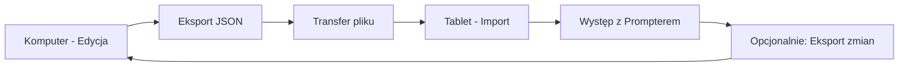
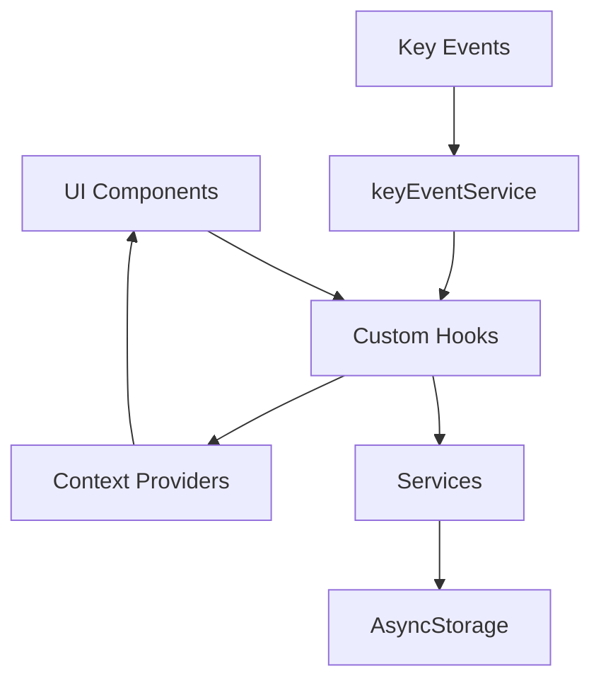

# Dokument Projektowy - StagePrompt

## Przegląd

StagePrompt to cross-platform aplikacja React Native + TypeScript zaprojektowana z myślą o dwóch środowiskach użytkowania:
1. **Komputer (Web/Desktop)** - wygodna edycja utworów, setlist i timingów na dużym ekranie
2. **Tablet/Telefon (Android/iOS)** - wyświetlanie tekstów podczas występów z precyzyjnie zsynchronizowanym przewijaniem

Kluczową innowacją jest algorytm płynnego przewijania oparty na interpolacji liniowej między linijkami z przypisanymi czasami, co zapewnia naturalne i przewidywalne przewijanie tekstu. Workflow zakłada pracę przygotowawczą na komputerze (edycja, ręczne ustawianie timingów) i eksport gotowych danych do urządzenia mobilnego używanego podczas występów.

### Kluczowe Cechy Techniczne

- **React Native + TypeScript** - cross-platform development z silnym typowaniem
- **Expo** - natywne wsparcie dla web, desktop i mobile
- **AsyncStorage** - lokalne przechowywanie danych (JSON) na wszystkich platformach
- **React Navigation** - nawigacja między ekranami
- **Reanimated 2** - płynne animacje przewijania (60 FPS) na mobile
- **react-native-keyevent** - obsługa kontrolerów Bluetooth działających jak klawiatura (Android)
- **Export/Import** - pełna synchronizacja danych między urządzeniami

### Architektura Wysokiego Poziomu

Aplikacja wykorzystuje architekturę warstwową z pełnym wsparciem cross-platform:
- **Warstwa UI** - komponenty React Native (ekrany, komponenty) - responsywne dla web i mobile
- **Warstwa Logiki Biznesowej** - hooks i serwisy (scroll algorithm, timing)
- **Warstwa Danych** - storage service (AsyncStorage wrapper) - kompatybilny z web (localStorage) i mobile
- **Warstwa Integracji** - key event handling, platform detection, export/import

### Workflow Cross-Platform



**Typowy przepływ pracy:**
1. Użytkownik pracuje na komputerze (przeglądarka lub Expo desktop)
2. Tworzy utwory, edytuje teksty, ręcznie ustawia timings dla linijek
3. Organizuje setlisty
4. Eksportuje wszystko do pliku JSON
5. Przenosi plik na tablet (email, cloud, USB)
6. Importuje dane w aplikacji mobilnej
7. Używa tabletu jako teleprompter podczas występu

## Architektura

### Struktura Katalogów

```
src/
├── types/           # Definicje TypeScript
│   ├── models.ts
│   └── navigation.ts
├── screens/         # Ekrany aplikacji
│   ├── SongListScreen.tsx
│   ├── SongEditorScreen.tsx
│   ├── SetlistEditorScreen.tsx
│   ├── PrompterScreen.tsx
│   └── SettingsScreen.tsx
├── components/      # Komponenty wielokrotnego użytku
│   ├── SongListItem.tsx
│   ├── LyricLineEditor.tsx
│   ├── PrompterControls.tsx
│   ├── KeyMappingDialog.tsx
│   ├── S18ConfigurationPanel.tsx      # NOWY - Konfiguracja S18
│   ├── S18ButtonTester.tsx            # NOWY - Testowanie przycisków
│   └── S18ClickZonesPreview.tsx       # NOWY - Preview stref kliknięć
├── services/        # Logika biznesowa
│   ├── storageService.ts
│   ├── scrollAlgorithm.ts
│   ├── keyEventService.ts
│   ├── s18ControllerService.ts        # NOWY - Obsługa kontrolera S18
│   └── exportImportService.ts
├── hooks/           # Custom React hooks
│   ├── useSongs.ts
│   ├── useSetlists.ts
│   ├── useSettings.ts
│   ├── usePrompterTimer.ts
│   ├── useKeyMapping.ts
│   └── useS18Controller.ts            # NOWY - Hook dla S18
├── context/         # React Context dla globalnego stanu
│   ├── DataContext.tsx
│   └── SettingsContext.tsx
└── utils/           # Funkcje pomocnicze
    ├── validation.ts
    ├── platform.ts
    └── s18Detection.ts                # NOWY - Wykrywanie S18
```

### Diagram Przepływu Danych



## Komponenty i Interfejsy

### Modele Danych (TypeScript)

```typescript
// types/models.ts

export type SectionType = 'verse' | 'chorus' | 'bridge' | 'intro' | 'outro' | 'instrumental' | 'custom';

export interface SongSection {
  type: SectionType;
  label?: string;      // Custom label for 'custom' type
  number?: number;     // Verse number (e.g., 1, 2, 3)
  startTime?: number;  // Start time of section in seconds (optional)
  endTime?: number;    // End time of section in seconds (optional)
}

export interface LyricLine {
  id: string;
  text: string;
  timeSeconds: number;  // Can be auto-calculated from section timing
  section?: SongSection; // Optional section marker
}

export interface Song {
  id: string;
  title: string;
  artist?: string;
  durationSeconds?: number;
  lines: LyricLine[];
  createdAt: number;
  updatedAt: number;
}

export interface Setlist {
  id: string;
  name: string;
  songIds: string[];
  createdAt: number;
  updatedAt: number;
}

export interface AppSettings {
  fontSize: number;           // 24-72
  anchorYPercent: number;     // 0.0-1.0 (default 0.4)
  textColor: string;          // hex color
  backgroundColor: string;    // hex color
  marginHorizontal: number;   // pixels
  lineHeight: number;         // pixels (default 60)
  scrollSpeedMultiplier: number; // 0.5-2.0 (default 1.0)
  showTouchHints: boolean;    // Show visual hints for touch controls
}

export interface KeyMapping {
  nextSong?: number;    // keyCode
  prevSong?: number;    // keyCode
  pause?: number;       // keyCode
}

// S18 Controller specific types
export type S18ButtonType = 'up' | 'down' | 'left' | 'right' | 'touch' | 'auxiliary';

export interface S18ButtonMapping {
  up: PrompterAction;         // Default: 'increaseSpeed'
  down: PrompterAction;       // Default: 'decreaseSpeed'
  left: PrompterAction;       // Default: 'prevSong'
  right: PrompterAction;      // Default: 'nextSong'
  touch: PrompterAction;      // Default: 'pause'
  auxiliary?: PrompterAction; // Optional: custom action
}

export interface S18ControllerConfig {
  enabled: boolean;
  mode: 'mouse' | 'keyboard';  // Detection mode
  buttonMapping: S18ButtonMapping;
  clickZones: {
    left: { x: number; width: number };    // Left zone for prev
    center: { x: number; width: number };  // Center zone for pause
    right: { x: number; width: number };   // Right zone for next
  };
  sensitivity: number;  // 0.5-2.0 for speed adjustments
}

export type PrompterAction = 
  | 'nextSong' 
  | 'prevSong' 
  | 'pause' 
  | 'increaseSpeed' 
  | 'decreaseSpeed'
  | 'resetSpeed';
```

### Główne Ekrany

#### 1. SetlistListScreen (Główny Widok)

**Odpowiedzialność:**
- Wyświetlanie listy setlist jako główny widok aplikacji
- Nawigacja do edytora setlisty
- Tworzenie nowych setlist
- Dostęp do panelu utworów

**Props:**
```typescript
interface SetlistListScreenProps {
  navigation: NavigationProp<RootStackParamList>;
}
```

**Kluczowe Komponenty:**
- `FlatList` z `SetlistListItem`
- FAB (Floating Action Button) dla nowej setlisty
- Przycisk dostępu do panelu utworów
- Empty state component

#### 2. SongListScreen (Panel Utworów)

**Odpowiedzialność:**
- Wyświetlanie listy wszystkich utworów
- Nawigacja do edytora utworu
- Tworzenie nowych utworów
- Usuwanie utworów

**Props:**
```typescript
interface SongListScreenProps {
  navigation: NavigationProp<RootStackParamList>;
}
```

**Kluczowe Komponenty:**
- `FlatList` z `SongListItem`
- FAB (Floating Action Button) dla nowego utworu
- Empty state component

#### 3. SongEditorScreen

**Odpowiedzialność:**
- Edycja metadanych utworu (tytuł, artysta)
- Zarządzanie linijkami tekstu
- Ręczne ustawianie timingów dla linijek
- Walidacja danych

**Stan Lokalny:**
```typescript
interface EditorState {
  song: Song;
}
```

**Komponenty:**
- Header z polami tytuł/artysta
- `DraggableFlatList` z `LyricLineEditor` (każda linijka ma pole do wprowadzenia czasu)
- Przyciski "+ Insert Line" między linijkami do wstawiania nowych linijek
- Drag handle (☰) w każdej linijce do zmiany kolejności przez long press

**Funkcjonalności:**
- **Dodawanie linijki na końcu**: Przycisk "+ Add Line" w nagłówku
- **Wstawianie linijki w środku**: Przyciski "+ Insert Line" między każdą parą linijek
- **Zmiana kolejności**: Long press na linijce aktywuje drag & drop
- **Auto-save**: Automatyczne zapisywanie przy każdej zmianie

#### 4. SetlistEditorScreen (z Panelem Utworów)

**Odpowiedzialność:**
- Edycja nazwy setlisty
- Wyświetlanie utworów w setliście
- Wyświetlanie panelu wszystkich dostępnych utworów obok
- Drag & drop utworów z panelu do setlisty
- Drag & drop reordering utworów w setliście
- Usuwanie utworów z setlisty

**Layout:**
- Na web/desktop: Split view (setlista po lewej, panel utworów po prawej)
- Na mobile: Tabs lub modal z listą utworów

**Biblioteki:**
- `react-native-draggable-flatlist` dla reordering
- `react-native-gesture-handler` dla drag & drop między panelami

#### 5. PrompterScreen

**Odpowiedzialność:**
- Fullscreen display tekstu
- Płynne przewijanie zsynchronizowane z czasem
- Kontrola odtwarzania
- Obsługa kontrolera zewnętrznego
- Obsługa kontrolera S18 (NOWY)
- Dynamiczna prędkość przewijania (NOWY)

**Stan:**
```typescript
interface PrompterState {
  currentSongIndex: number;
  currentTime: number;
  isPlaying: boolean;
  scrollY: Animated.Value;
  scrollSpeedMultiplier: number;  // NOWY - 0.5 to 2.0
}
```

**Kluczowe Funkcje:**
- Timer loop (useEffect z setInterval) - z uwzględnieniem scrollSpeedMultiplier
- Scroll calculation (scrollAlgorithm.ts)
- Animated scroll
- Key event handling
- S18 controller action handling (NOWY)
- Speed adjustment (NOWY)

**Integracja z S18:**

```typescript
// W PrompterScreen
const { config: s18Config, isEnabled: s18Enabled } = useS18Controller();

useEffect(() => {
  if (s18Enabled) {
    s18ControllerService.onAction((action) => {
      handleS18Action(action);
    });
  }
}, [s18Enabled]);

const handleS18Action = (action: PrompterAction) => {
  switch (action) {
    case 'nextSong':
      goToNextSong();
      break;
    case 'prevSong':
      goToPrevSong();
      break;
    case 'pause':
      togglePlayPause();
      break;
    case 'increaseSpeed':
      adjustSpeed(1.1); // +10%
      break;
    case 'decreaseSpeed':
      adjustSpeed(0.9); // -10%
      break;
    case 'resetSpeed':
      setScrollSpeedMultiplier(1.0);
      break;
  }
};

const adjustSpeed = (factor: number) => {
  setScrollSpeedMultiplier(prev => {
    const newSpeed = prev * factor;
    return Math.max(0.5, Math.min(2.0, newSpeed)); // Clamp 0.5-2.0
  });
};
```

#### 6. SettingsScreen

**Odpowiedzialność:**
- Konfiguracja wyglądu promptera
- Mapowanie klawiszy
- Import/export danych
- Konfiguracja kontrolera S18

**Sekcje:**
- Appearance settings
- Key mapping configuration
- S18 Controller configuration (nowa sekcja)
- Data management

**Nowa Sekcja - S18 Controller:**

```typescript
interface S18ConfigSectionProps {
  config: S18ControllerConfig;
  onConfigChange: (config: S18ControllerConfig) => void;
}
```

**Komponenty w sekcji S18:**
- Toggle "Enable S18 Controller"
- Mode selector (Mouse / Keyboard / Auto-detect)
- Button mapping editor
- Test buttons interface
- Click zones configuration (dla trybu myszy)
- Sensitivity slider

### Komponenty

#### S18ConfigurationPanel

**Nowy komponent dla konfiguracji kontrolera S18:**

```typescript
interface S18ConfigurationPanelProps {
  config: S18ControllerConfig;
  onSave: (config: S18ControllerConfig) => void;
  onCancel: () => void;
}
```

**Funkcjonalności:**

1. **Mode Selection**
   - Radio buttons: Mouse / Keyboard / Auto-detect
   - Opis każdego trybu
   - Automatyczne wykrywanie (przycisk "Detect")

2. **Button Mapping Editor**
   - Lista przycisków S18 (Up, Down, Left, Right, Touch, Auxiliary)
   - Dropdown dla każdego przycisku z dostępnymi akcjami
   - Domyślne mapowanie:
     - Up → Increase Speed
     - Down → Decrease Speed
     - Left → Previous Song
     - Right → Next Song
     - Touch → Pause/Play

3. **Button Testing Interface**
   - Przycisk "Test Buttons"
   - Wizualizacja każdego przycisku S18
   - Real-time feedback przy naciśnięciu
   - Wyświetlanie wykrytej akcji

4. **Click Zones Configuration** (tylko dla trybu myszy)
   - Wizualizacja ekranu podzielonego na 3 strefy
   - Slider do dostosowania szerokości stref
   - Preview z ikonami akcji

5. **Sensitivity Settings**
   - Slider dla czułości zmian prędkości (0.5x - 2.0x)
   - Preview aktualnej wartości

**Layout:**

```
┌─────────────────────────────────────┐
│ S18 Controller Configuration        │
├─────────────────────────────────────┤
│ [✓] Enable S18 Controller           │
│                                     │
│ Mode: ○ Mouse ● Keyboard ○ Auto    │
│       [Detect Mode]                 │
│                                     │
│ Button Mapping:                     │
│ ┌─────────────────────────────────┐ │
│ │ Up:    [Increase Speed ▼]      │ │
│ │ Down:  [Decrease Speed ▼]      │ │
│ │ Left:  [Previous Song  ▼]      │ │
│ │ Right: [Next Song      ▼]      │ │
│ │ Touch: [Pause/Play     ▼]      │ │
│ └─────────────────────────────────┘ │
│                                     │
│ [Test Buttons]                      │
│ ┌─────────────────────────────────┐ │
│ │     ▲                           │ │
│ │   ◄ ● ►  [Touch]               │ │
│ │     ▼                           │ │
│ │ Status: Waiting...              │ │
│ └─────────────────────────────────┘ │
│                                     │
│ Sensitivity: [====●====] 1.0x      │
│                                     │
│ [Save]  [Cancel]  [Reset Defaults] │
└─────────────────────────────────────┘
```

#### S18ButtonTester

**Komponent do testowania przycisków:**

```typescript
interface S18ButtonTesterProps {
  onButtonDetected: (button: S18ButtonType, action: PrompterAction) => void;
  isActive: boolean;
}
```

**Funkcjonalności:**
- Wizualizacja układu przycisków S18
- Real-time highlighting przy naciśnięciu
- Wyświetlanie wykrytej akcji
- Timeout po 5 sekundach bez aktywności

#### S18ClickZonesPreview

**Komponent do konfiguracji stref kliknięć:**

```typescript
interface S18ClickZonesPreviewProps {
  zones: S18ControllerConfig['clickZones'];
  onZonesChange: (zones: S18ControllerConfig['clickZones']) => void;
}
```

**Funkcjonalności:**
- Wizualizacja 3 stref (lewo, środek, prawo)
- Interaktywne dostosowanie szerokości
- Ikony akcji w każdej strefie
- Preview w skali ekranu promptera

### Serwisy

#### storageService.ts

```typescript
interface StorageService {
  // Songs
  saveSong(song: Song): Promise<void>;
  loadSongs(): Promise<Song[]>;
  deleteSong(id: string): Promise<void>;
  
  // Setlists
  saveSetlist(setlist: Setlist): Promise<void>;
  loadSetlists(): Promise<Setlist[]>;
  deleteSetlist(id: string): Promise<void>;
  
  // Settings
  saveSettings(settings: AppSettings): Promise<void>;
  loadSettings(): Promise<AppSettings>;
  
  // Key Mappings
  saveKeyMapping(mapping: KeyMapping): Promise<void>;
  loadKeyMapping(): Promise<KeyMapping>;
  
  // S18 Controller Config (NOWY)
  saveS18Config(config: S18ControllerConfig): Promise<void>;
  loadS18Config(): Promise<S18ControllerConfig | null>;
  
  // Export/Import
  exportData(): Promise<string>; // JSON string
  importData(jsonString: string): Promise<void>;
}
```

**Implementacja:**
- Każdy typ danych w osobnym kluczu AsyncStorage
- Songs: `@songs:${id}`
- Setlists: `@setlists:${id}`
- Settings: `@settings`
- KeyMapping: `@keyMapping`
- S18Config: `@s18_config` (NOWY)
- Index arrays: `@songs_index`, `@setlists_index`

#### scrollAlgorithm.ts

Implementacja algorytmu z Twojego opisu:

```typescript
interface ScrollCalculationParams {
  currentTime: number;
  lines: LyricLine[];
  lineHeight: number;
  anchorY: number;
}

export function calculateScrollY(params: ScrollCalculationParams): number {
  const { currentTime, lines, lineHeight, anchorY } = params;
  
  if (!lines.length) return 0;
  
  const yLine = (index: number) => index * lineHeight;
  
  // Before first line
  if (currentTime <= lines[0].timeSeconds) {
    return yLine(0) - anchorY;
  }
  
  // After last line
  const last = lines.length - 1;
  if (currentTime >= lines[last].timeSeconds) {
    return yLine(last) - anchorY;
  }
  
  // Find surrounding lines
  let i = 0;
  while (i < lines.length - 1 && currentTime > lines[i + 1].timeSeconds) {
    i++;
  }
  
  // Linear interpolation
  const t0 = lines[i].timeSeconds;
  const t1 = lines[i + 1].timeSeconds;
  const y0 = yLine(i);
  const y1 = yLine(i + 1);
  const fraction = (currentTime - t0) / (t1 - t0);
  const y = y0 + (y1 - y0) * fraction;
  
  return y - anchorY;
}
```

#### Section-Based Timing (Uproszczone Wprowadzanie Czasów)

**Koncepcja:**

Zamiast wymagać czasu dla każdej linijki, użytkownik określa tylko:
1. **Czas rozpoczęcia sekcji** (startTime) - dla pierwszej linijki sekcji
2. **Czas zakończenia sekcji** (endTime) - dla ostatniej linijki sekcji

Linijki pośrednie są automatycznie interpolowane równomiernie w czasie trwania sekcji.

**Przykład:**

```
[Verse 1] Start: 0:10, End: 0:30
  - "First line"      → auto: 10.0s
  - "Second line"     → auto: 16.67s
  - "Third line"      → auto: 23.33s
  - "Fourth line"     → auto: 30.0s

[Chorus] Start: 0:35, End: 0:50
  - "Chorus line 1"   → auto: 35.0s
  - "Chorus line 2"   → auto: 42.5s
  - "Chorus line 3"   → auto: 50.0s
```

**Algorytm Interpolacji Czasów:**

```typescript
// utils/timingInterpolation.ts

/**
 * Calculates interpolated times for lines within a section.
 * If a line has explicit timeSeconds, it's used. Otherwise, it's interpolated
 * based on section startTime and endTime.
 */
export function calculateLineTimes(lines: LyricLine[]): LyricLine[] {
  const result: LyricLine[] = [];
  let currentSectionLines: LyricLine[] = [];
  let currentSection: SongSection | undefined;
  
  for (let i = 0; i < lines.length; i++) {
    const line = lines[i];
    
    // Check if this is the start of a new section
    const isNewSection = line.section && (
      !currentSection ||
      line.section.type !== currentSection.type ||
      line.section.number !== currentSection.number ||
      line.section.label !== currentSection.label
    );
    
    // Process previous section if we're starting a new one
    if (isNewSection && currentSectionLines.length > 0) {
      result.push(...interpolateSectionTimes(currentSectionLines, currentSection));
      currentSectionLines = [];
    }
    
    // Update current section
    if (line.section) {
      currentSection = line.section;
    }
    
    currentSectionLines.push(line);
  }
  
  // Process last section
  if (currentSectionLines.length > 0) {
    result.push(...interpolateSectionTimes(currentSectionLines, currentSection));
  }
  
  return result;
}

function interpolateSectionTimes(
  lines: LyricLine[],
  section: SongSection | undefined
): LyricLine[] {
  // If no section or no timing info, return as-is
  if (!section || section.startTime === undefined || section.endTime === undefined) {
    return lines;
  }
  
  const { startTime, endTime } = section;
  const count = lines.length;
  
  if (count === 0) return lines;
  if (count === 1) {
    return [{
      ...lines[0],
      timeSeconds: startTime,
    }];
  }
  
  // Interpolate times evenly across the section
  return lines.map((line, index) => {
    const fraction = index / (count - 1);
    const interpolatedTime = startTime + (endTime - startTime) * fraction;
    
    return {
      ...line,
      timeSeconds: interpolatedTime,
    };
  });
}
```

**Integracja z UI:**

W `SongEditorScreen`, przy pierwszej linijce sekcji pokazują się dwa pola:
- **Start sekcji**: Input dla `section.startTime`
- **Koniec sekcji**: Input dla `section.endTime`

Czasy są automatycznie przeliczane przy każdej zmianie i wyświetlane jako podpowiedź przy każdej linijce.

**Kompatybilność Wsteczna:**

- Linijki bez sekcji używają `timeSeconds` bezpośrednio (stary sposób)
- Linijki z sekcją ale bez `startTime`/`endTime` również używają `timeSeconds`
- System obsługuje mieszane podejście (niektóre sekcje z timing, inne bez)

#### SongEditorScreen - Line Management

**Funkcje zarządzania linijkami:**

```typescript
// Dodawanie linijki na końcu
const addLine = () => {
  const newLine: LyricLine = {
    id: generateId(),
    text: '',
    timeSeconds: song.lines.length > 0 
      ? song.lines[song.lines.length - 1].timeSeconds 
      : 0,
  };
  setSong(prev => ({ ...prev, lines: [...prev.lines, newLine] }));
};

// Wstawianie linijki po określonym indeksie
const insertLineAfter = (index: number) => {
  const currentLine = song.lines[index];
  const nextLine = song.lines[index + 1];
  
  // Oblicz czas dla nowej linijki (między obecną a następną)
  const newTime = nextLine 
    ? (currentLine.timeSeconds + nextLine.timeSeconds) / 2
    : currentLine.timeSeconds + 1;
  
  const newLine: LyricLine = {
    id: generateId(),
    text: '',
    timeSeconds: newTime,
  };
  
  setSong(prev => ({
    ...prev,
    lines: [
      ...prev.lines.slice(0, index + 1),
      newLine,
      ...prev.lines.slice(index + 1),
    ],
  }));
};

// Zmiana kolejności przez drag & drop
const handleDragEnd = ({ data }: { data: LyricLine[] }) => {
  setSong(prev => ({ ...prev, lines: data }));
};
```

**Użycie DraggableFlatList:**
- Biblioteka: `react-native-draggable-flatlist`
- Long press na linijce aktywuje tryb przeciągania
- Wizualny feedback (opacity, shadow) podczas przeciągania
- Drag handle (☰) wskazuje możliwość przeciągania

#### keyEventService.ts

```typescript
interface KeyEventService {
  initialize(): void;
  cleanup(): void;
  setKeyMapping(mapping: KeyMapping): void;
  onAction(callback: (action: PrompterAction) => void): void;
}
```

**Implementacja:**
- Używa `react-native-keyevent` na Android
- Na web/desktop używa standardowych keyboard events
- Debouncing (300ms) dla zapobiegania wielokrotnym akcjom
- Platform detection dla graceful degradation

#### s18ControllerService.ts

**Nowy serwis dedykowany dla kontrolera S18:**

```typescript
interface S18ControllerService {
  initialize(config: S18ControllerConfig): void;
  cleanup(): void;
  setConfig(config: S18ControllerConfig): void;
  onAction(callback: (action: PrompterAction) => void): void;
  detectMode(): 'mouse' | 'keyboard' | 'unknown';
  testButton(button: S18ButtonType): Promise<boolean>;
}
```

**Implementacja:**

```typescript
// services/s18ControllerService.ts

class S18ControllerServiceImpl implements S18ControllerService {
  private config: S18ControllerConfig;
  private actionCallback?: (action: PrompterAction) => void;
  private lastActionTime: number = 0;
  private debounceMs: number = 300;
  
  initialize(config: S18ControllerConfig): void {
    this.config = config;
    
    if (!config.enabled) return;
    
    if (config.mode === 'mouse') {
      this.initializeMouseMode();
    } else if (config.mode === 'keyboard') {
      this.initializeKeyboardMode();
    }
  }
  
  private initializeMouseMode(): void {
    // Obsługa kliknięć w zdefiniowanych obszarach ekranu
    // Kontroler S18 w trybie myszy wysyła kliknięcia
    // Używamy PrompterTouchControls do wykrywania kliknięć
  }
  
  private initializeKeyboardMode(): void {
    // Obsługa zdarzeń klawiatury z kontrolera S18
    // Jeśli kontroler działa jako klawiatura, używamy keyEventService
    if (Platform.OS === 'android') {
      KeyEvent.onKeyDownListener((keyEvent) => {
        this.handleKeyEvent(keyEvent.keyCode);
      });
    } else if (Platform.OS === 'web') {
      document.addEventListener('keydown', (e) => {
        this.handleKeyEvent(e.keyCode);
      });
    }
  }
  
  private handleKeyEvent(keyCode: number): void {
    const now = Date.now();
    if (now - this.lastActionTime < this.debounceMs) return;
    
    const action = this.mapKeyCodeToAction(keyCode);
    if (action && this.actionCallback) {
      this.actionCallback(action);
      this.lastActionTime = now;
    }
  }
  
  private mapKeyCodeToAction(keyCode: number): PrompterAction | null {
    // Mapowanie kodów klawiszy na akcje
    // Kody dla S18 w trybie klawiatury (do ustalenia przez testy)
    const keyMap: Record<number, S18ButtonType> = {
      19: 'up',      // KEYCODE_DPAD_UP
      20: 'down',    // KEYCODE_DPAD_DOWN
      21: 'left',    // KEYCODE_DPAD_LEFT
      22: 'right',   // KEYCODE_DPAD_RIGHT
      66: 'touch',   // KEYCODE_ENTER (przykład)
    };
    
    const button = keyMap[keyCode];
    if (!button) return null;
    
    return this.config.buttonMapping[button];
  }
  
  onAction(callback: (action: PrompterAction) => void): void {
    this.actionCallback = callback;
  }
  
  detectMode(): 'mouse' | 'keyboard' | 'unknown' {
    // Automatyczne wykrywanie trybu kontrolera
    // Próbuje wykryć czy kontroler wysyła zdarzenia myszy czy klawiatury
    return 'mouse'; // Domyślnie dla S18
  }
  
  async testButton(button: S18ButtonType): Promise<boolean> {
    // Testowanie przycisku - czeka na naciśnięcie
    // Używane w trybie konfiguracji
    return new Promise((resolve) => {
      const timeout = setTimeout(() => resolve(false), 5000);
      
      const handler = (action: PrompterAction) => {
        if (this.config.buttonMapping[button] === action) {
          clearTimeout(timeout);
          resolve(true);
        }
      };
      
      this.onAction(handler);
    });
  }
  
  setConfig(config: S18ControllerConfig): void {
    this.cleanup();
    this.initialize(config);
  }
  
  cleanup(): void {
    // Cleanup event listeners
    this.actionCallback = undefined;
  }
}

export const s18ControllerService = new S18ControllerServiceImpl();
```

**Kluczowe Funkcje:**

1. **Dual Mode Support** - obsługa trybu myszy i klawiatury
2. **Auto-detection** - automatyczne wykrywanie trybu kontrolera
3. **Button Testing** - tryb testowania przycisków dla konfiguracji
4. **Debouncing** - zapobieganie wielokrotnym akcjom
5. **Configurable Mapping** - elastyczne mapowanie przycisków

#### exportImportService.ts

```typescript
interface ExportData {
  version: string;
  exportDate: number;
  songs: Song[];
  setlists: Setlist[];
}

export function exportAllData(
  songs: Song[],
  setlists: Setlist[]
): string {
  const data: ExportData = {
    version: '1.0',
    exportDate: Date.now(),
    songs,
    setlists,
  };
  return JSON.stringify(data, null, 2);
}

export function validateImportData(jsonString: string): boolean {
  // Validate JSON structure
  // Check required fields
  // Return true if valid
}

export function importData(
  jsonString: string,
  mode: 'merge' | 'replace'
): { songs: Song[]; setlists: Setlist[] } {
  // Parse and validate
  // Return data to be saved
}
```

### Custom Hooks

#### usePrompterTimer

```typescript
interface UsePrompterTimerReturn {
  currentTime: number;
  isPlaying: boolean;
  play: () => void;
  pause: () => void;
  reset: () => void;
  seek: (time: number) => void;
}

export function usePrompterTimer(): UsePrompterTimerReturn {
  // setInterval loop (50-100ms)
  // State management
  // Cleanup on unmount
}
```

#### useSongs

```typescript
export function useSongs() {
  const [songs, setSongs] = useState<Song[]>([]);
  const [loading, setLoading] = useState(true);
  
  const loadSongs = async () => { /* ... */ };
  const saveSong = async (song: Song) => { /* ... */ };
  const deleteSong = async (id: string) => { /* ... */ };
  
  useEffect(() => {
    loadSongs();
  }, []);
  
  return { songs, loading, saveSong, deleteSong, reload: loadSongs };
}
```

#### useS18Controller

**Nowy hook dla kontrolera S18:**

```typescript
interface UseS18ControllerReturn {
  config: S18ControllerConfig;
  isEnabled: boolean;
  updateConfig: (config: Partial<S18ControllerConfig>) => Promise<void>;
  testButton: (button: S18ButtonType) => Promise<boolean>;
  detectMode: () => 'mouse' | 'keyboard' | 'unknown';
  resetToDefaults: () => Promise<void>;
}

export function useS18Controller(): UseS18ControllerReturn {
  const [config, setConfig] = useState<S18ControllerConfig>(getDefaultS18Config());
  const [isEnabled, setIsEnabled] = useState(false);
  
  // Load config from storage on mount
  useEffect(() => {
    loadS18Config();
  }, []);
  
  // Initialize service when config changes
  useEffect(() => {
    if (config.enabled) {
      s18ControllerService.initialize(config);
    } else {
      s18ControllerService.cleanup();
    }
    return () => s18ControllerService.cleanup();
  }, [config]);
  
  const loadS18Config = async () => {
    try {
      const saved = await storageService.loadS18Config();
      if (saved) {
        setConfig(saved);
        setIsEnabled(saved.enabled);
      }
    } catch (error) {
      console.error('Failed to load S18 config:', error);
    }
  };
  
  const updateConfig = async (partial: Partial<S18ControllerConfig>) => {
    const newConfig = { ...config, ...partial };
    setConfig(newConfig);
    setIsEnabled(newConfig.enabled);
    await storageService.saveS18Config(newConfig);
  };
  
  const testButton = async (button: S18ButtonType): Promise<boolean> => {
    return await s18ControllerService.testButton(button);
  };
  
  const detectMode = (): 'mouse' | 'keyboard' | 'unknown' => {
    return s18ControllerService.detectMode();
  };
  
  const resetToDefaults = async () => {
    const defaults = getDefaultS18Config();
    await updateConfig(defaults);
  };
  
  return {
    config,
    isEnabled,
    updateConfig,
    testButton,
    detectMode,
    resetToDefaults,
  };
}

// Default configuration
function getDefaultS18Config(): S18ControllerConfig {
  return {
    enabled: false,
    mode: 'mouse',
    buttonMapping: {
      up: 'increaseSpeed',
      down: 'decreaseSpeed',
      left: 'prevSong',
      right: 'nextSong',
      touch: 'pause',
    },
    clickZones: {
      left: { x: 0, width: 0.33 },
      center: { x: 0.33, width: 0.34 },
      right: { x: 0.67, width: 0.33 },
    },
    sensitivity: 1.0,
  };
}
```

## Modele Danych

Szczegółowe modele zostały opisane w sekcji "Komponenty i Interfejsy". Kluczowe aspekty:

### Relacje

- **Song** ↔ **Setlist**: Many-to-Many przez `songIds` array
- **LyricLine** ↔ **Song**: One-to-Many (embedded w Song)
- **KeyMapping**: Singleton configuration object
- **AppSettings**: Singleton configuration object

### Walidacja

```typescript
// utils/validation.ts

export function validateSong(song: Partial<Song>): string[] {
  const errors: string[] = [];
  
  if (!song.title?.trim()) {
    errors.push('Tytuł jest wymagany');
  }
  
  if (song.lines) {
    song.lines.forEach((line, index) => {
      if (line.timeSeconds < 0) {
        errors.push(`Linijka ${index + 1}: czas nie może być ujemny`);
      }
      if (index > 0 && line.timeSeconds < song.lines[index - 1].timeSeconds) {
        errors.push(`Linijka ${index + 1}: czas musi być większy niż poprzednia linijka`);
      }
    });
  }
  
  return errors;
}

export function validateLyricLine(line: Partial<LyricLine>): string[] {
  const errors: string[] = [];
  
  if (line.text === undefined || line.text === null) {
    errors.push('Tekst linijki jest wymagany');
  }
  
  if (line.timeSeconds !== undefined && line.timeSeconds < 0) {
    errors.push('Czas nie może być ujemny');
  }
  
  return errors;
}
```

### Generowanie ID

```typescript
// utils/idGenerator.ts

export function generateId(): string {
  return `${Date.now()}-${Math.random().toString(36).substr(2, 9)}`;
}
```


## Właściwości Poprawności (Correctness Properties)

*Właściwość to charakterystyka lub zachowanie, które powinno być prawdziwe dla wszystkich poprawnych wykonań systemu - zasadniczo formalne stwierdzenie o tym, co system powinien robić. Właściwości służą jako pomost między specyfikacją czytelną dla człowieka a gwarancjami poprawności weryfikowalnymi maszynowo.*

### Property 1: Lista setlist wyświetla wszystkie zapisane setlisty

*Dla dowolnej* listy setlist zapisanych w storage, otwarcie aplikacji powinno wyświetlić wszystkie setlisty z poprawnymi nazwami i liczbą utworów.

**Validates: Requirements 1.1**

### Property 2: Nawigacja do edytora setlisty przekazuje poprawną setlistę

*Dla dowolnej* setlisty na liście, dotknięcie tej setlisty powinno nawigować do edytora z tą samą setlistą (sprawdzając ID i zawartość).

**Validates: Requirements 1.2**

### Property 3: Panel utworów wyświetla wszystkie utwory

*Dla dowolnej* listy utworów zapisanych w storage, otwarcie panelu utworów powinno wyświetlić wszystkie utwory z poprawnymi tytułami i wykonawcami.

**Validates: Requirements 2.1**

### Property 3a: Nawigacja z panelu utworów do edytora

*Dla dowolnego* utworu w panelu utworów, dotknięcie tego utworu powinno nawigować do edytora z tym samym utworem (sprawdzając ID i zawartość).

**Validates: Requirements 2.2, 3.6**

### Property 3b: Usunięcie utworu usuwa go ze wszystkich setlist

*Dla dowolnego* utworu który jest w jednej lub więcej setlistach, usunięcie tego utworu powinno usunąć jego ID ze wszystkich setlist które go zawierały.

**Validates: Requirements 2.5**

### Property 4: Dodawanie linijki zwiększa liczbę linijek

*Dla dowolnego* utworu, dodanie nowej linijki tekstu powinno zwiększyć liczbę linijek o 1 i nowa linijka powinna mieć unikalne ID różne od wszystkich istniejących.

**Validates: Requirements 4.3**

### Property 5: Usuwanie linijki zmniejsza liczbę linijek

*Dla dowolnego* utworu z co najmniej jedną linijką, usunięcie linijki powinno zmniejszyć liczbę linijek o 1 i usunięta linijka nie powinna już istnieć w utworze.

**Validates: Requirements 4.4**

### Property 5a: Modyfikacja metadanych aktualizuje utwór

*Dla dowolnego* utworu i dowolnych nowych wartości tytułu/wykonawcy, modyfikacja powinna zaktualizować dane utworu i zmiany powinny być widoczne natychmiast.

**Validates: Requirements 4.2**

### Property 6: Przeciągnięcie utworu dodaje go do setlisty

*Dla dowolnej* setlisty i dowolnego utworu z panelu utworów, przeciągnięcie utworu do setlisty powinno dodać jego ID do songIds w miejscu upuszczenia.

**Validates: Requirements 3.2**

### Property 7: Zmiana kolejności aktualizuje songIds

*Dla dowolnej* setlisty z utworami, zmiana kolejności utworów (np. przeniesienie z pozycji i na pozycję j) powinna zaktualizować tablicę songIds tak, aby odzwierciedlała nową kolejność.

**Validates: Requirements 3.3**

### Property 8: Usunięcie utworu z setlisty nie usuwa utworu

*Dla dowolnej* setlisty zawierającej utwór, usunięcie tego utworu z setlisty powinno usunąć jego ID z songIds, ale utwór powinien nadal istnieć w głównej liście utworów.

**Validates: Requirements 3.4**

### Property 9: Usunięcie setlisty nie wpływa na utwory

*Dla dowolnej* setlisty zawierającej utwory, usunięcie setlisty nie powinno usunąć żadnego z utworów z głównej listy utworów.

**Validates: Requirements 3.5**

### Property 10: Algorytm przewijania - interpolacja liniowa

*Dla dowolnych* dwóch kolejnych linijek z czasami t0 i t1, oraz dowolnego czasu currentTime gdzie t0 < currentTime < t1, obliczona pozycja scrollY powinna być liniową interpolacją między pozycjami tych linijek: `y = y0 + (y1 - y0) * ((currentTime - t0) / (t1 - t0))`.

**Validates: Requirements 4.5 (poprzednio 5.6)**

### Property 11: Pauza i wznowienie zachowuje pozycję

*Dla dowolnego* stanu promptera z aktualnym czasem T, wykonanie pauzy a następnie wznowienia powinno zachować czas T (z tolerancją kilku milisekund).

**Validates: Requirements 6.2**

### Property 12: Nawigacja do następnego utworu w setliście

*Dla dowolnej* setlisty z co najmniej dwoma utworami, będąc na utworze o indeksie i (gdzie i < length - 1), dotknięcie "następny" powinno załadować utwór o indeksie i+1 i zresetować timer do 0.

**Validates: Requirements 6.3**

### Property 13: Nawigacja do poprzedniego utworu w setliście

*Dla dowolnej* setlisty z co najmniej dwoma utworami, będąc na utworze o indeksie i (gdzie i > 0), dotknięcie "poprzedni" powinno załadować utwór o indeksie i-1 i zresetować timer do 0.

**Validates: Requirements 6.4**

### Property 14: Zmapowany klawisz wykonuje akcję

*Dla dowolnego* keyCode zmapowanego na akcję (nextSong, prevSong, pause), naciśnięcie tego klawisza powinno wykonać odpowiednią akcję.

**Validates: Requirements 7.2**

### Property 15: Niezmapowany klawisz nie zmienia stanu

*Dla dowolnego* keyCode który nie jest zmapowany, naciśnięcie tego klawisza nie powinno zmienić żadnego stanu aplikacji (currentTime, currentSongIndex, isPlaying pozostają bez zmian).

**Validates: Requirements 7.3**

### Property 16: Debounce zapobiega wielokrotnym akcjom

*Dla dowolnej* sekwencji zdarzeń klawisza tego samego keyCode przychodzących w odstępach < 300ms, tylko pierwsze zdarzenie powinno wywołać akcję.

**Validates: Requirements 7.5**

### Property 17: Mapowanie klawisza tworzy powiązanie

*Dla dowolnego* keyCode i akcji, wykonanie mapowania (capture keyCode podczas trybu mapowania) powinno utworzyć powiązanie, które można następnie odczytać z KeyMapping.

**Validates: Requirements 8.2**

### Property 18: Round-trip persystencji mapowań klawiszy

*Dla dowolnego* obiektu KeyMapping, zapisanie go do storage a następnie załadowanie powinno zwrócić równoważny obiekt.

**Validates: Requirements 8.3, 8.5**

### Property 19: Czyszczenie mapowania usuwa powiązanie

*Dla dowolnego* zmapowanego keyCode, wykonanie operacji czyszczenia powinno spowodować, że ten keyCode nie jest już powiązany z żadną akcją.

**Validates: Requirements 8.4**

### Property 20: Zmiana ustawień aktualizuje konfigurację

*Dla dowolnego* ustawienia (fontSize, anchorYPercent, textColor, backgroundColor, marginHorizontal) i dowolnej poprawnej wartości, zmiana ustawienia powinna zaktualizować obiekt AppSettings.

**Validates: Requirements 9.1, 9.2, 9.3, 9.4**

### Property 21: Round-trip persystencji ustawień

*Dla dowolnego* obiektu AppSettings, zapisanie go do storage a następnie załadowanie powinno zwrócić równoważny obiekt.

**Validates: Requirements 9.5**

### Property 22: Round-trip persystencji utworu

*Dla dowolnego* utworu Song, zapisanie go do AsyncStorage a następnie załadowanie powinno zwrócić równoważny obiekt (wszystkie pola identyczne).

**Validates: Requirements 10.1, 10.3**

### Property 23: Round-trip persystencji setlisty

*Dla dowolnej* setlisty Setlist, zapisanie jej do AsyncStorage a następnie załadowanie powinno zwrócić równoważny obiekt.

**Validates: Requirements 10.2, 10.3**

### Property 24: Błąd storage nie zmienia stanu w pamięci

*Dla dowolnego* stanu aplikacji (lista utworów, setlist), gdy operacja storage zawodzi (symulowany błąd), stan w pamięci powinien pozostać niezmieniony.

**Validates: Requirements 10.4**

### Property 25: Usunięcie usuwa dane ze storage

*Dla dowolnego* utworu lub setlisty, wykonanie operacji usunięcia powinno spowodować, że próba załadowania tego elementu ze storage zwróci null lub undefined.

**Validates: Requirements 10.5**

### Property 26: Klawiatura działa jak kontroler na web/desktop

*Dla dowolnego* zdarzenia klawiatury na platformie web/desktop, system powinien traktować je tak samo jak zdarzenie z kontrolera zewnętrznego (jeśli keyCode jest zmapowany).

**Validates: Requirements 11.3**

### Property 27: Graceful degradation bez Bluetooth

*Dla dowolnej* platformy gdzie Bluetooth jest niedostępny, aplikacja powinna działać normalnie z kontrolami dotykowymi/myszą bez crashowania.

**Validates: Requirements 11.4**

### Property 28: Round-trip eksportu i importu

*Dla dowolnego* zestawu utworów i setlist, eksport do JSON a następnie import tego JSON powinien zwrócić równoważne dane.

**Validates: Requirements 12.1, 12.3**

### Property 29: Walidacja odrzuca niepoprawne dane importu

*Dla dowolnego* niepoprawnego JSON (brakujące pola, złe typy, niepoprawna struktura), walidacja powinna zwrócić false i import nie powinien zmienić istniejących danych.

**Validates: Requirements 12.2, 12.4**

### Property 30: Cross-platform kompatybilność danych

*Dla dowolnego* zestawu utworów i setlist wyeksportowanych na jednej platformie (web/desktop), import na innej platformie (mobile) powinien zachować wszystkie dane bez utraty informacji.

**Validates: Requirements 13.4, 13.5**

### Property 31: Pełna funkcjonalność edycji na komputerze

*Dla dowolnej* operacji edycji (tworzenie utworu, edycja linijek, nagrywanie timingu, zarządzanie setlistami), wykonanie jej na platformie web/desktop powinno działać identycznie jak na mobile.

**Validates: Requirements 13.1, 13.2**

### Property 32: Wykrywanie kontrolera S18

*Dla dowolnego* sparowanego kontrolera S18, system powinien wykryć kontroler jako urządzenie wejściowe i umożliwić jego konfigurację.

**Validates: Requirements 14.1**

### Property 33: Mapowanie przycisku prawo na następny utwór

*Dla dowolnej* setlisty z co najmniej dwoma utworami, naciśnięcie przycisku kierunkowego w prawo na kontrolerze S18 powinno przejść do następnego utworu.

**Validates: Requirements 14.2**

### Property 34: Mapowanie przycisku lewo na poprzedni utwór

*Dla dowolnej* setlisty z co najmniej dwoma utworami, naciśnięcie przycisku kierunkowego w lewo na kontrolerze S18 powinno przejść do poprzedniego utworu.

**Validates: Requirements 14.3**

### Property 35: Mapowanie przycisku Touch na pause/play

*Dla dowolnego* stanu promptera (playing lub paused), naciśnięcie przycisku Touch na kontrolerze S18 powinno przełączyć stan odtwarzania.

**Validates: Requirements 14.4**

### Property 36: Zwiększanie prędkości przewijania

*Dla dowolnej* prędkości przewijania V (gdzie V < 2.0), naciśnięcie przycisku kierunkowego w górę powinno zwiększyć prędkość do V * 1.1 (z maksimum 2.0).

**Validates: Requirements 14.5**

### Property 37: Zmniejszanie prędkości przewijania

*Dla dowolnej* prędkości przewijania V (gdzie V > 0.5), naciśnięcie przycisku kierunkowego w dół powinno zmniejszyć prędkość do V * 0.9 (z minimum 0.5).

**Validates: Requirements 14.6**

### Property 38: Round-trip persystencji konfiguracji S18

*Dla dowolnej* konfiguracji S18ControllerConfig, zapisanie jej do storage a następnie załadowanie powinno zwrócić równoważną konfigurację.

**Validates: Requirements 14.9**

### Property 39: Wykrywanie kliknięć w strefach ekranu

*Dla dowolnego* kliknięcia myszy w zdefiniowanej strefie ekranu (lewo/środek/prawo), system powinien wykonać odpowiednią akcję przypisaną do tej strefy.

**Validates: Requirements 14.10**

### Property 40: Testowanie przycisków kontrolera

*Dla dowolnego* przycisku S18 w trybie testowania, naciśnięcie tego przycisku powinno wywołać wizualny feedback i wyświetlić wykrytą akcję.

**Validates: Requirements 14.8**

## Obsługa Błędów

### Strategie Obsługi Błędów

#### 1. Storage Errors

```typescript
try {
  await AsyncStorage.setItem(key, value);
} catch (error) {
  console.error('Storage error:', error);
  // Show user-friendly error message
  Alert.alert(
    'Błąd zapisu',
    'Nie udało się zapisać danych. Sprawdź dostępną pamięć.',
    [{ text: 'OK' }]
  );
  // Keep in-memory state unchanged
}
```

#### 2. Validation Errors

```typescript
const errors = validateSong(song);
if (errors.length > 0) {
  Alert.alert(
    'Błąd walidacji',
    errors.join('\n'),
    [{ text: 'OK' }]
  );
  return; // Don't save invalid data
}
```

#### 3. Key Event Errors

```typescript
try {
  KeyEvent.onKeyDownListener((keyEvent) => {
    handleKeyEvent(keyEvent);
  });
} catch (error) {
  console.warn('Key events not available on this platform');
  // Gracefully degrade - app works without external controller
}
```

#### 4. Import/Export Errors

```typescript
try {
  const data = JSON.parse(jsonString);
  if (!validateImportData(data)) {
    throw new Error('Invalid data structure');
  }
  // Proceed with import
} catch (error) {
  Alert.alert(
    'Błąd importu',
    'Plik jest uszkodzony lub ma niepoprawny format.',
    [{ text: 'OK' }]
  );
  // Preserve existing data
}
```

#### 5. S18 Controller Errors

```typescript
try {
  s18ControllerService.initialize(config);
} catch (error) {
  console.warn('S18 Controller initialization failed:', error);
  // Gracefully degrade - app works with touch controls
  // Show optional notification to user
  if (config.enabled) {
    Alert.alert(
      'Kontroler S18',
      'Nie udało się zainicjalizować kontrolera S18. Aplikacja będzie działać z kontrolami dotykowymi.',
      [{ text: 'OK' }]
    );
  }
}

// Button detection timeout
try {
  const detected = await s18ControllerService.testButton('right');
  if (!detected) {
    Alert.alert(
      'Test przycisku',
      'Nie wykryto naciśnięcia przycisku. Sprawdź czy kontroler jest sparowany i włączony.',
      [{ text: 'OK' }]
    );
  }
} catch (error) {
  console.error('Button test failed:', error);
  // Show error to user
}

// Invalid configuration
try {
  validateS18Config(config);
} catch (error) {
  Alert.alert(
    'Niepoprawna konfiguracja',
    'Konfiguracja kontrolera S18 jest niepoprawna. Przywrócono domyślne ustawienia.',
    [{ text: 'OK' }]
  );
  // Reset to defaults
  config = getDefaultS18Config();
}
```

### Error Boundaries

Dla React Native używamy error boundaries do łapania błędów renderowania:

```typescript
class ErrorBoundary extends React.Component<Props, State> {
  state = { hasError: false };
  
  static getDerivedStateFromError(error: Error) {
    return { hasError: true };
  }
  
  componentDidCatch(error: Error, errorInfo: React.ErrorInfo) {
    console.error('React error:', error, errorInfo);
  }
  
  render() {
    if (this.state.hasError) {
      return <ErrorScreen onReset={() => this.setState({ hasError: false })} />;
    }
    return this.props.children;
  }
}
```

## Strategia Testowania

### Podejście Dual Testing

Aplikacja będzie testowana przy użyciu dwóch komplementarnych podejść:

1. **Testy jednostkowe (Unit Tests)** - weryfikują konkretne przykłady, przypadki brzegowe i warunki błędów
2. **Testy oparte na właściwościach (Property-Based Tests)** - weryfikują uniwersalne właściwości, które powinny być prawdziwe dla wszystkich wejść

Razem zapewniają kompleksowe pokrycie: testy jednostkowe wychwytują konkretne błędy, testy właściwości weryfikują ogólną poprawność.

### Framework Testowy

**Property-Based Testing:** `fast-check` (https://github.com/dubzzz/fast-check)
- Biblioteka PBT dla TypeScript/JavaScript
- Generuje losowe dane testowe
- Automatycznie znajduje przypadki brzegowe
- Shrinking - minimalizuje przykłady niepowodzeń

**Unit Testing:** `Jest` + `@testing-library/react-native`
- Standard dla React Native
- Dobre wsparcie dla TypeScript
- Snapshot testing dla komponentów UI

**End-to-End Testing:** `MCP Playwright Server` (https://github.com/executeautomation/mcp-playwright)
- Testowanie przez Model Context Protocol - umożliwia interakcję z przeglądarką przez MCP
- Cross-browser testing (Chromium, Firefox, WebKit)
- Testowanie aplikacji web w rzeczywistym środowisku przeglądarki
- Automatyczne czekanie na elementy i snapshoty dostępności
- Wsparcie dla interakcji użytkownika (kliknięcia, wpisywanie tekstu, nawigacja)
- Screenshots i console logs dla debugowania
- Testowanie pełnych przepływów użytkownika od początku do końca
- Integracja z Kiro IDE przez MCP dla interaktywnego testowania

### Konfiguracja Property-Based Tests

Każdy test właściwości powinien:
- Uruchamiać minimum **100 iteracji** (konfiguracja fast-check: `{ numRuns: 100 }`)
- Być oznaczony komentarzem referencyjnym: `**Feature: StagePrompt, Property X: [opis właściwości]**`
- Implementować dokładnie jedną właściwość z sekcji Correctness Properties

### Przykładowe Testy

#### Property Test - Algorytm Przewijania

```typescript
import fc from 'fast-check';
import { calculateScrollY } from '../services/scrollAlgorithm';

/**
 * Feature: StagePrompt, Property 10: Algorytm przewijania - interpolacja liniowa
 */
describe('calculateScrollY - linear interpolation', () => {
  it('should interpolate linearly between two lines', () => {
    fc.assert(
      fc.property(
        fc.array(fc.record({
          id: fc.string(),
          text: fc.string(),
          timeSeconds: fc.float({ min: 0, max: 1000 })
        }), { minLength: 2 }).map(lines => 
          lines.sort((a, b) => a.timeSeconds - b.timeSeconds)
        ),
        fc.float({ min: 0, max: 100 }),
        fc.float({ min: 0, max: 1000 }),
        (lines, lineHeight, anchorY) => {
          // Pick two consecutive lines
          const i = Math.floor(Math.random() * (lines.length - 1));
          const t0 = lines[i].timeSeconds;
          const t1 = lines[i + 1].timeSeconds;
          
          if (t1 <= t0) return true; // Skip if times are equal
          
          // Pick time between them
          const currentTime = t0 + (t1 - t0) * 0.5; // midpoint
          
          const scrollY = calculateScrollY({
            currentTime,
            lines,
            lineHeight,
            anchorY
          });
          
          const y0 = i * lineHeight;
          const y1 = (i + 1) * lineHeight;
          const expectedY = y0 + (y1 - y0) * 0.5 - anchorY;
          
          return Math.abs(scrollY - expectedY) < 0.01;
        }
      ),
      { numRuns: 100 }
    );
  });
});
```

#### Property Test - Round-trip Persystencji

```typescript
/**
 * Feature: StagePrompt, Property 22: Round-trip persystencji utworu
 */
describe('Song persistence round-trip', () => {
  it('should preserve song data through save/load cycle', async () => {
    await fc.assert(
      fc.asyncProperty(
        fc.record({
          id: fc.string(),
          title: fc.string({ minLength: 1 }),
          artist: fc.option(fc.string()),
          durationSeconds: fc.option(fc.float({ min: 0 })),
          lines: fc.array(fc.record({
            id: fc.string(),
            text: fc.string(),
            timeSeconds: fc.float({ min: 0 })
          })),
          createdAt: fc.integer({ min: 0 }),
          updatedAt: fc.integer({ min: 0 })
        }),
        async (song) => {
          await storageService.saveSong(song);
          const loaded = await storageService.loadSong(song.id);
          
          expect(loaded).toEqual(song);
          return true;
        }
      ),
      { numRuns: 100 }
    );
  });
});
```

#### Unit Test - Przypadek Brzegowy

```typescript
describe('SongListScreen - empty state', () => {
  it('should display empty message when no songs exist', () => {
    const { getByText } = render(
      <SongListScreen songs={[]} />
    );
    
    expect(getByText(/utwórz pierwszy utwór/i)).toBeTruthy();
  });
});
```

#### End-to-End Test - Pełny Przepływ (MCP Playwright)

**Przykład 1: Zarządzanie utworami**

```
Feature: StagePrompt, E2E Test: Zarządzanie utworami
Validates: Requirements 1.1, 1.2, 1.3, 2.1, 2.2, 2.3, 2.4

Kroki testowe z MCP Playwright:

1. mcp_playwright_browser_navigate({ url: "http://localhost:8081" })
2. mcp_playwright_browser_snapshot() - Sprawdź czy widoczny komunikat "utwórz pierwszy utwór"
3. mcp_playwright_browser_click({ element: "przycisk Nowy Utwór", ref: "..." })
4. mcp_playwright_browser_type({ element: "pole Tytuł", ref: "...", text: "Test Song" })
5. mcp_playwright_browser_type({ element: "pole Wykonawca", ref: "...", text: "Test Artist" })
6. mcp_playwright_browser_click({ element: "przycisk Dodaj Linijkę", ref: "..." })
7. mcp_playwright_browser_fill_form({ fields: [
     { name: "tekst linijki", type: "textbox", ref: "...", value: "First line" },
     { name: "czas", type: "textbox", ref: "...", value: "0" }
   ]})
8. mcp_playwright_browser_click({ element: "przycisk Dodaj Linijkę", ref: "..." })
9. mcp_playwright_browser_fill_form({ fields: [
     { name: "tekst linijki", type: "textbox", ref: "...", value: "Second line" },
     { name: "czas", type: "textbox", ref: "...", value: "5" }
   ]})
10. mcp_playwright_browser_navigate_back()
11. mcp_playwright_browser_snapshot() - Sprawdź czy widoczny "Test Song" i "Test Artist"
12. mcp_playwright_browser_take_screenshot({ filename: "song-created.png" })
13. mcp_playwright_browser_click({ element: "przycisk Usuń", ref: "..." })
14. mcp_playwright_browser_click({ element: "przycisk Potwierdź", ref: "..." })
15. mcp_playwright_browser_snapshot() - Sprawdź czy lista jest pusta
```

**Przykład 2: Eksport i Import**

```
Feature: StagePrompt, E2E Test: Eksport i Import
Validates: Requirements 12.1, 12.2, 12.3, 12.4

Kroki testowe z MCP Playwright:

1. mcp_playwright_browser_navigate({ url: "http://localhost:8081" })
2. mcp_playwright_browser_click({ element: "przycisk Nowy Utwór", ref: "..." })
3. mcp_playwright_browser_type({ element: "pole Tytuł", ref: "...", text: "Export Test Song" })
4. mcp_playwright_browser_navigate_back()
5. mcp_playwright_browser_click({ element: "przycisk Ustawienia", ref: "..." })
6. mcp_playwright_browser_click({ element: "przycisk Eksportuj", ref: "..." })
7. mcp_playwright_browser_console_messages() - Sprawdź logi eksportu
8. mcp_playwright_browser_evaluate({ function: "() => localStorage.getItem('@songs_index')" })
9. mcp_playwright_browser_take_screenshot({ filename: "export-complete.png" })
```

**Zalety MCP Playwright:**
- Interaktywne testowanie bezpośrednio z Kiro IDE
- Możliwość eksploracji aplikacji przed napisaniem testów
- Automatyczne snapshoty dostępności (accessibility tree)
- Łatwe debugowanie przez screenshots i console logs
- Możliwość zapisania sesji testowej jako skryptu

### Generatory dla Property Tests

Tworzymy smart generatory, które generują poprawne dane:

```typescript
// test/generators.ts

export const songGenerator = fc.record({
  id: fc.string(),
  title: fc.string({ minLength: 1, maxLength: 100 }),
  artist: fc.option(fc.string({ maxLength: 100 })),
  durationSeconds: fc.option(fc.float({ min: 0, max: 3600 })),
  lines: fc.array(
    fc.record({
      id: fc.string(),
      text: fc.string({ maxLength: 200 }),
      timeSeconds: fc.float({ min: 0, max: 3600 })
    })
  ).map(lines => lines.sort((a, b) => a.timeSeconds - b.timeSeconds)), // Ensure sorted
  createdAt: fc.integer({ min: 0 }),
  updatedAt: fc.integer({ min: 0 })
});

export const setlistGenerator = fc.record({
  id: fc.string(),
  name: fc.string({ minLength: 1, maxLength: 100 }),
  songIds: fc.array(fc.string()),
  createdAt: fc.integer({ min: 0 }),
  updatedAt: fc.integer({ min: 0 })
});
```

### Strategia Testów End-to-End (MCP Playwright)

Testy E2E z MCP Playwright weryfikują pełne przepływy użytkownika w rzeczywistym środowisku przeglądarki przez Model Context Protocol. Skupiają się na:

**Główne Przepływy do Przetestowania:**

1. **Zarządzanie Utworami**
   - Tworzenie, edycja, usuwanie utworów
   - Dodawanie i usuwanie linijek tekstu
   - Ustawianie timingów
   - Walidacja danych wejściowych

2. **Zarządzanie Setlistami**
   - Tworzenie setlist
   - Dodawanie utworów do setlist
   - Zmiana kolejności (drag & drop)
   - Usuwanie utworów i setlist

3. **Eksport i Import**
   - Eksport danych do JSON
   - Import danych z JSON
   - Walidacja formatu
   - Round-trip testing

4. **Konfiguracja**
   - Zmiana ustawień wyglądu
   - Mapowanie klawiszy
   - Persystencja konfiguracji

5. **Prompter**
   - Wyświetlanie tekstu
   - Kontrola odtwarzania
   - Nawigacja między utworami
   - Obsługa klawiatury

**Best Practices dla Testów MCP Playwright:**

- **Interaktywne eksplorowanie** - Użyj MCP tools do manualnego przetestowania przepływu przed automatyzacją
- **Snapshoty dostępności** - Używaj `mcp_playwright_browser_snapshot()` do weryfikacji struktury UI
- **Screenshots dla dokumentacji** - Rób screenshots kluczowych stanów aplikacji
- **Console logs** - Sprawdzaj `mcp_playwright_browser_console_messages()` dla błędów JavaScript
- **Evaluate dla weryfikacji** - Używaj `mcp_playwright_browser_evaluate()` do sprawdzania stanu localStorage
- **Dokumentuj kroki** - Zapisuj sekwencje MCP calls jako dokumentację testową
- **Testuj na różnych przeglądarkach** - Zmień `PLAYWRIGHT_BROWSER` w konfiguracji MCP

**Workflow testowania z MCP:**

1. **Eksploracja (Manualna)**
   ```
   - Uruchom: npm run web
   - Użyj MCP tools w Kiro IDE do interakcji z aplikacją
   - Obserwuj snapshoty i screenshots
   - Zapisz sekwencję kroków
   ```

2. **Dokumentacja (Semi-automatyczna)**
   ```
   - Zapisz sekwencję MCP calls jako test case
   - Dodaj asercje bazując na snapshotach
   - Udokumentuj oczekiwane zachowanie
   ```

3. **Automatyzacja (Opcjonalna)**
   ```
   - Przekonwertuj sekwencję MCP calls na skrypt
   - Dodaj do CI/CD pipeline
   - Uruchamiaj regularnie
   ```

**Przykładowy Test Case (Format Dokumentacyjny):**

```markdown
## Test Case: TC-001 - Tworzenie i edycja utworu

**Warunki wstępne:**
- Aplikacja uruchomiona na http://localhost:8081
- Brak utworów w systemie

**Kroki:**
1. Navigate: http://localhost:8081
2. Snapshot: Weryfikuj empty state
3. Click: "Nowy Utwór"
4. Type: Tytuł = "Mój Utwór"
5. Type: Wykonawca = "Artysta"
6. Click: "Dodaj Linijkę"
7. Fill form: tekst="Pierwsza linijka", czas="0"
8. Screenshot: song-editor-with-line.png
9. Navigate back
10. Snapshot: Weryfikuj że utwór jest na liście

**Oczekiwany rezultat:**
- Utwór "Mój Utwór" widoczny na liście
- Wykonawca "Artysta" wyświetlony
- Jedna linijka tekstu zapisana

**Validates:** Requirements 1.3, 2.1, 2.2, 2.3
```

**Struktura Dokumentacji Testów:**

```
e2e/
├── test-cases/
│   ├── TC-001-song-creation.md
│   ├── TC-002-setlist-management.md
│   ├── TC-003-export-import.md
│   └── TC-004-prompter-flow.md
├── screenshots/
│   ├── song-editor-empty.png
│   ├── song-editor-with-lines.png
│   └── prompter-fullscreen.png
└── README.md (instrukcje uruchamiania testów)
```

### Pokrycie Testami

**Priorytet 1 - Krytyczna Logika:**
- Algorytm przewijania (scrollAlgorithm.ts) - property tests
- Storage service - property tests (round-trips)
- Walidacja danych - unit tests + property tests

**Priorytet 2 - Logika Biznesowa:**
- Key event handling - property tests
- Timer logic - unit tests
- Navigation logic - unit tests

**Priorytet 3 - UI Components:**
- Snapshot tests dla głównych ekranów
- Integration tests dla krytycznych przepływów
- Unit tests dla przypadków brzegowych

**Priorytet 4 - End-to-End Flows (Playwright):**
- Pełny przepływ zarządzania utworami (tworzenie, edycja, usuwanie)
- Pełny przepływ zarządzania setlistami (tworzenie, dodawanie utworów, zmiana kolejności)
- Przepływ eksportu i importu danych
- Przepływ konfiguracji ustawień
- Cross-platform workflow (edycja na web → eksport → weryfikacja formatu)

### Uruchamianie Testów

```bash
# Wszystkie testy jednostkowe i property-based
npm test

# Tylko property tests
npm test -- --testNamePattern="Property"

# Z coverage
npm test -- --coverage

# Watch mode podczas developmentu
npm test -- --watch

# Testy end-to-end z MCP Playwright
# Uruchom aplikację web w osobnym terminalu: npm run web
# Następnie użyj narzędzi MCP Playwright w Kiro IDE do interaktywnego testowania
```

### Konfiguracja MCP Playwright

**Konfiguracja MCP Server:**

Aplikacja używa MCP Playwright Server do testowania E2E. Konfiguracja w `.kiro/settings/mcp.json`:

```json
{
  "mcpServers": {
    "playwright": {
      "command": "npx",
      "args": ["-y", "@executeautomation/mcp-playwright"],
      "env": {
        "PLAYWRIGHT_BROWSER": "chromium"
      },
      "disabled": false,
      "autoApprove": [
        "mcp_playwright_browser_navigate",
        "mcp_playwright_browser_snapshot",
        "mcp_playwright_browser_click",
        "mcp_playwright_browser_type",
        "mcp_playwright_browser_take_screenshot"
      ]
    }
  }
}
```

**Dostępne narzędzia MCP Playwright:**

- `mcp_playwright_browser_navigate` - Nawigacja do URL
- `mcp_playwright_browser_snapshot` - Snapshot dostępności strony
- `mcp_playwright_browser_click` - Kliknięcie elementu
- `mcp_playwright_browser_type` - Wpisywanie tekstu
- `mcp_playwright_browser_fill_form` - Wypełnianie formularzy
- `mcp_playwright_browser_take_screenshot` - Robienie screenshotów
- `mcp_playwright_browser_console_messages` - Pobieranie logów konsoli
- `mcp_playwright_browser_evaluate` - Wykonywanie JavaScript
- `mcp_playwright_browser_close` - Zamykanie przeglądarki

**Workflow testowania z MCP:**

1. Uruchom aplikację web: `npm run web`
2. Użyj narzędzi MCP Playwright do interakcji z aplikacją
3. Weryfikuj zachowanie przez snapshoty i screenshots
4. Zapisuj testy jako skrypty do automatyzacji

## Platform-Specific Considerations

### Web/Desktop (Środowisko Edycji - Primary)

- **Cel:** Wygodna edycja utworów na dużym ekranie
- **Input:** Klawiatura + mysz - pełne wsparcie
- **Storage:** AsyncStorage używa localStorage (persystencja w przeglądarce)
- **Export/Import:** Pełne wsparcie - download/upload plików JSON
- **Prompter:** Funkcjonalny do testowania, ale nie główny use case
- **Bluetooth:** Niedostępne - graceful degradation
- **Performance:** Standardowa wydajność przeglądarki

### Android/iOS (Środowisko Występu)

- **Cel:** Wyświetlanie tekstów podczas występów
- **Bluetooth/Key Events:** Pełne wsparcie przez `react-native-keyevent` (Android)
- **Storage:** AsyncStorage działa natywnie
- **Performance:** Reanimated 2 zapewnia 60 FPS na większości tabletów
- **Fullscreen:** `react-native-immersive-mode` dla prawdziwego fullscreen
- **Export/Import:** Pełne wsparcie - share/receive plików
- **Touch Events:** Natywne wsparcie

### Platform Detection

```typescript
// utils/platform.ts

import { Platform } from 'react-native';

export const isWeb = Platform.OS === 'web';
export const isAndroid = Platform.OS === 'android';
export const isIOS = Platform.OS === 'ios';
export const isMobile = isAndroid || isIOS;

export const supportsKeyEvents = isAndroid || isWeb;
export const supportsBluetooth = isAndroid; // iOS może wymagać dodatkowej konfiguracji

export function getStorageImplementation() {
  if (isWeb) {
    return webStorage; // localStorage wrapper
  }
  return AsyncStorage;
}

// Określa czy to środowisko edycji czy występu
export const isEditingEnvironment = isWeb;
export const isPerformanceEnvironment = isMobile;
```

### UI Adaptacje Cross-Platform

**Desktop/Web:**
- Większe przyciski i kontrolki (optymalizacja pod mysz)
- Skróty klawiszowe dla szybkiej edycji
- Drag & drop plików dla importu
- Szersze layouty wykorzystujące przestrzeń ekranu

**Mobile:**
- Touch-friendly kontrolki (większe touch targets)
- Swipe gestures
- Fullscreen prompter bez rozpraszaczy
- Optymalizacja pod pionową i poziomą orientację

## Performance Considerations

### Scroll Performance

- Używamy `Reanimated 2` dla animacji na UI thread (60 FPS)
- Timer update co 50-100ms (10-20 FPS) - wystarczające dla płynnego scrollu
- `FlatList` z `windowSize` dla długich tekstów
- `getItemLayout` dla stałej wysokości linijek

### Memory Management

- Lazy loading utworów (tylko aktywna setlista w pamięci)
- Cleanup timerów w `useEffect` cleanup
- Debouncing dla key events (300ms)
- Throttling dla scroll calculations

### Storage Optimization

- Batch writes gdzie możliwe
- Index arrays dla szybkiego listowania
- Compression dla dużych tekstów (opcjonalnie)

## Cross-Platform Workflow - Szczegóły Implementacji

### Eksport na Komputerze (Web)

```typescript
// W SettingsScreen - przycisk Export
const handleExport = async () => {
  const jsonData = await exportImportService.exportAllData(songs, setlists);
  
  // Web: trigger download
  if (Platform.OS === 'web') {
    const blob = new Blob([jsonData], { type: 'application/json' });
    const url = URL.createObjectURL(blob);
    const link = document.createElement('a');
    link.href = url;
    link.download = `stageprompt-backup-${Date.now()}.json`;
    link.click();
    URL.revokeObjectURL(url);
  }
};
```

### Import na Mobile

```typescript
// W SettingsScreen - przycisk Import
const handleImport = async () => {
  // Mobile: użyj DocumentPicker
  if (Platform.OS !== 'web') {
    const result = await DocumentPicker.getDocumentAsync({
      type: 'application/json',
    });
    
    if (result.type === 'success') {
      const fileContent = await FileSystem.readAsStringAsync(result.uri);
      const { songs, setlists } = await exportImportService.importData(
        fileContent,
        'merge' // lub 'replace'
      );
      // Zapisz do storage
    }
  }
};
```

### Transfer Danych - Opcje dla Użytkownika

1. **Email** - wyeksportuj i wyślij do siebie
2. **Cloud Storage** - Google Drive, Dropbox, iCloud
3. **USB/Cable** - bezpośredni transfer
4. **QR Code** (przyszła funkcja) - dla małych zestawów danych
5. **Local Network** (przyszła funkcja) - bezpośrednia synchronizacja

### Walidacja Kompatybilności

```typescript
interface ExportData {
  version: string;        // Format version dla backward compatibility
  platform: string;       // 'web' | 'android' | 'ios'
  exportDate: number;
  appVersion: string;     // Wersja aplikacji
  songs: Song[];
  setlists: Setlist[];
}

export function validateCrossPlatformCompatibility(data: ExportData): boolean {
  // Sprawdź wersję formatu
  if (!isVersionCompatible(data.version)) {
    return false;
  }
  
  // Sprawdź strukturę danych
  if (!validateDataStructure(data)) {
    return false;
  }
  
  return true;
}
```

## Future Enhancements

### Faza 2 (Post-MVP)

1. **SQLite Migration**
   - Lepsza wydajność dla dużych bibliotek
   - Relacyjne zapytania
   - Migracja z AsyncStorage

2. **Advanced Bluetooth**
   - BLE support (`react-native-ble-plx`)
   - MIDI controller support
   - Custom protocol dla dedykowanych kontrolerów

3. **Cloud Sync & Automatyczna Synchronizacja**
   - Firebase/Supabase backend
   - Automatyczna synchronizacja między komputerem a tabletem
   - Real-time updates
   - Backup w chmurze
   - Conflict resolution przy jednoczesnej edycji

4. **Tryb Nagrywania Timingu**
   - Real-time timing recording z stoperem
   - Przycisk "Ustaw Czas" przy każdej linijce podczas nagrywania
   - Automatyczne przypisywanie czasów podczas odtwarzania muzyki
   - Szybsze workflow dla użytkowników z dużą ilością utworów

5. **Advanced Features**
   - Mirror mode (odbicie tekstu)
   - Multiple anchor points
   - Variable scroll speed
   - Auto-scroll bez timingów (constant speed)

### Faza 3 (Advanced)

1. **Collaboration**
   - Sharing songs/setlists
   - Community library
   - Version control dla tekstów

2. **AI Features**
   - Auto-timing z audio analysis
   - Lyrics fetching z API
   - Smart setlist suggestions

## Decyzje Projektowe i Uzasadnienia

### Dlaczego Expo?

- Szybki development i testowanie
- Web support out-of-the-box
- Łatwe updates OTA
- Można eject jeśli potrzeba native modules

### Dlaczego AsyncStorage zamiast SQLite na start?

- Prostsze API
- Wystarczające dla MVP (< 1000 utworów)
- Łatwa migracja później
- Mniej dependencies

### Dlaczego Reanimated 2?

- Animacje na UI thread (60 FPS)
- Lepsze niż Animated API
- Standard w React Native community

### Dlaczego fast-check?

- Najlepszy PBT framework dla TypeScript
- Aktywnie rozwijany
- Dobre shrinking
- Integracja z Jest

### Dlaczego react-native-keyevent?

- Najprostsza biblioteka dla key events
- Działa z kontrolerami BT jako klawiatura
- Nie wymaga skomplikowanej konfiguracji BLE
