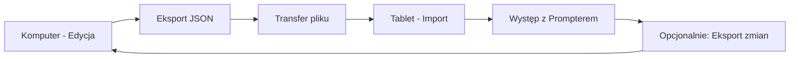
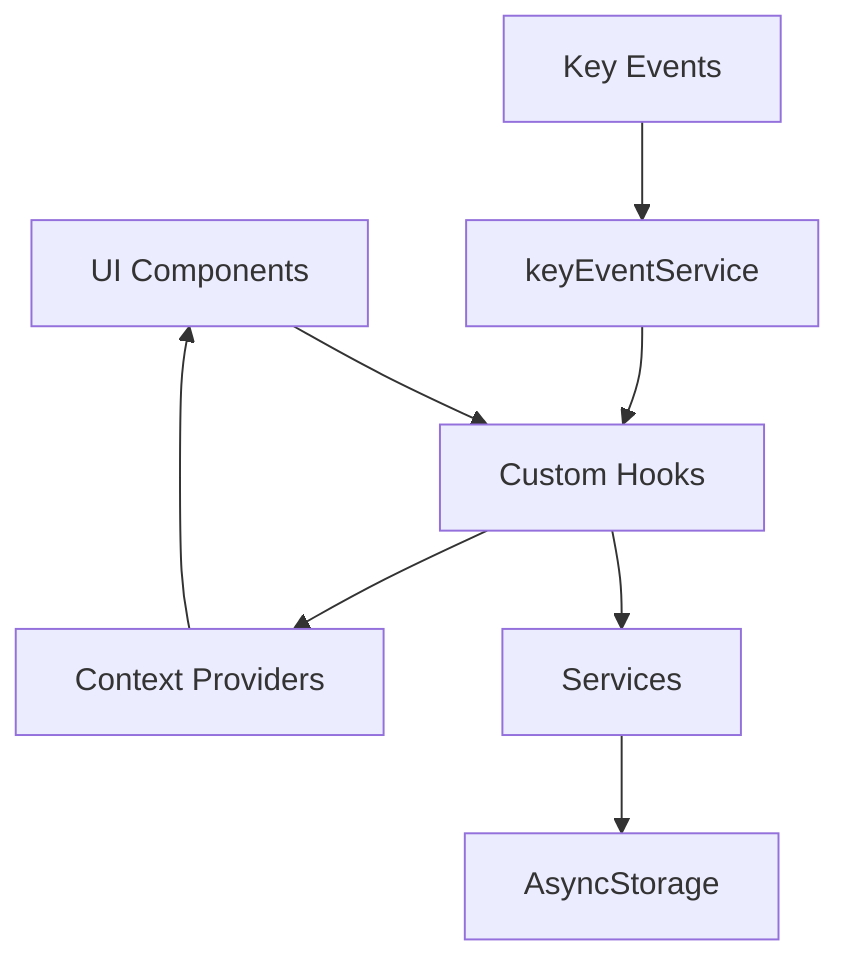

# Dokument Projektowy - StagePrompt

## Przegląd

StagePrompt to cross-platform aplikacja React Native + TypeScript zaprojektowana z myślą o dwóch środowiskach użytkowania:
1. **Komputer (Web/Desktop)** - wygodna edycja utworów, setlist i timingów na dużym ekranie
2. **Tablet/Telefon (Android/iOS)** - wyświetlanie tekstów podczas występów z precyzyjnie zsynchronizowanym przewijaniem

Kluczową innowacją jest algorytm płynnego przewijania oparty na interpolacji liniowej między linijkami z przypisanymi czasami, co zapewnia naturalne i przewidywalne przewijanie tekstu. Workflow zakłada pracę przygotowawczą na komputerze (edycja, ręczne ustawianie timingów) i eksport gotowych danych do urządzenia mobilnego używanego podczas występów.

### Kluczowe Cechy Techniczne

- **React Native + TypeScript** - cross-platform development z silnym typowaniem
- **Expo** - natywne wsparcie dla web, desktop i mobile
- **AsyncStorage** - lokalne przechowywanie danych (JSON) na wszystkich platformach
- **React Navigation** - nawigacja między ekranami
- **Reanimated 2** - płynne animacje przewijania (60 FPS) na mobile
- **react-native-keyevent** - obsługa kontrolerów Bluetooth działających jak klawiatura (Android)
- **Export/Import** - pełna synchronizacja danych między urządzeniami

### Architektura Wysokiego Poziomu

Aplikacja wykorzystuje architekturę warstwową z pełnym wsparciem cross-platform:
- **Warstwa UI** - komponenty React Native (ekrany, komponenty) - responsywne dla web i mobile
- **Warstwa Logiki Biznesowej** - hooks i serwisy (scroll algorithm, timing)
- **Warstwa Danych** - storage service (AsyncStorage wrapper) - kompatybilny z web (localStorage) i mobile
- **Warstwa Integracji** - key event handling, platform detection, export/import

### Workflow Cross-Platform



**Typowy przepływ pracy:**
1. Użytkownik pracuje na komputerze (przeglądarka lub Expo desktop)
2. Tworzy utwory, edytuje teksty, ręcznie ustawia timings dla linijek
3. Organizuje setlisty
4. Eksportuje wszystko do pliku JSON
5. Przenosi plik na tablet (email, cloud, USB)
6. Importuje dane w aplikacji mobilnej
7. Używa tabletu jako teleprompter podczas występu

## Architektura

### Struktura Katalogów

```
src/
├── types/           # Definicje TypeScript
│   ├── models.ts
│   └── navigation.ts
├── screens/         # Ekrany aplikacji
│   ├── SongListScreen.tsx
│   ├── SongEditorScreen.tsx
│   ├── SetlistEditorScreen.tsx
│   ├── PrompterScreen.tsx
│   └── SettingsScreen.tsx
├── components/      # Komponenty wielokrotnego użytku
│   ├── SongListItem.tsx
│   ├── LyricLineEditor.tsx
│   ├── PrompterControls.tsx
│   └── KeyMappingDialog.tsx
├── services/        # Logika biznesowa
│   ├── storageService.ts
│   ├── scrollAlgorithm.ts
│   ├── keyEventService.ts
│   └── exportImportService.ts
├── hooks/           # Custom React hooks
│   ├── useSongs.ts
│   ├── useSetlists.ts
│   ├── useSettings.ts
│   ├── usePrompterTimer.ts
│   └── useKeyMapping.ts
├── context/         # React Context dla globalnego stanu
│   ├── DataContext.tsx
│   └── SettingsContext.tsx
└── utils/           # Funkcje pomocnicze
    ├── validation.ts
    └── platform.ts
```

### Diagram Przepływu Danych



## Komponenty i Interfejsy

### Modele Danych (TypeScript)

```typescript
// types/models.ts

export interface LyricLine {
  id: string;
  text: string;
  timeSeconds: number;
}

export interface Song {
  id: string;
  title: string;
  artist?: string;
  durationSeconds?: number;
  lines: LyricLine[];
  createdAt: number;
  updatedAt: number;
}

export interface Setlist {
  id: string;
  name: string;
  songIds: string[];
  createdAt: number;
  updatedAt: number;
}

export interface AppSettings {
  fontSize: number;           // 24-72
  anchorYPercent: number;     // 0.0-1.0 (default 0.4)
  textColor: string;          // hex color
  backgroundColor: string;    // hex color
  marginHorizontal: number;   // pixels
  lineHeight: number;         // pixels (default 60)
}

export interface KeyMapping {
  nextSong?: number;    // keyCode
  prevSong?: number;    // keyCode
  pause?: number;       // keyCode
}

export type PrompterAction = 'nextSong' | 'prevSong' | 'pause';
```

### Główne Ekrany

#### 1. SongListScreen

**Odpowiedzialność:**
- Wyświetlanie listy utworów
- Nawigacja do edytora
- Tworzenie nowych utworów
- Dodawanie do setlist

**Props:**
```typescript
interface SongListScreenProps {
  navigation: NavigationProp<RootStackParamList>;
}
```

**Kluczowe Komponenty:**
- `FlatList` z `SongListItem`
- FAB (Floating Action Button) dla nowego utworu
- Empty state component

#### 2. SongEditorScreen

**Odpowiedzialność:**
- Edycja metadanych utworu (tytuł, artysta)
- Zarządzanie linijkami tekstu
- Ręczne ustawianie timingów dla linijek
- Walidacja danych

**Stan Lokalny:**
```typescript
interface EditorState {
  song: Song;
}
```

**Komponenty:**
- Header z polami tytuł/artysta
- `FlatList` z `LyricLineEditor` (każda linijka ma pole do wprowadzenia czasu)

#### 3. SetlistEditorScreen

**Odpowiedzialność:**
- Tworzenie i edycja setlist
- Dodawanie/usuwanie utworów
- Drag & drop reordering

**Biblioteki:**
- `react-native-draggable-flatlist` dla reordering

#### 4. PrompterScreen

**Odpowiedzialność:**
- Fullscreen display tekstu
- Płynne przewijanie zsynchronizowane z czasem
- Kontrola odtwarzania
- Obsługa kontrolera zewnętrznego

**Stan:**
```typescript
interface PrompterState {
  currentSongIndex: number;
  currentTime: number;
  isPlaying: boolean;
  scrollY: Animated.Value;
}
```

**Kluczowe Funkcje:**
- Timer loop (useEffect z setInterval)
- Scroll calculation (scrollAlgorithm.ts)
- Animated scroll
- Key event handling

#### 5. SettingsScreen

**Odpowiedzialność:**
- Konfiguracja wyglądu promptera
- Mapowanie klawiszy
- Import/export danych

**Sekcje:**
- Appearance settings
- Key mapping configuration
- Data management

### Serwisy

#### storageService.ts

```typescript
interface StorageService {
  // Songs
  saveSong(song: Song): Promise<void>;
  loadSongs(): Promise<Song[]>;
  deleteSong(id: string): Promise<void>;
  
  // Setlists
  saveSetlist(setlist: Setlist): Promise<void>;
  loadSetlists(): Promise<Setlist[]>;
  deleteSetlist(id: string): Promise<void>;
  
  // Settings
  saveSettings(settings: AppSettings): Promise<void>;
  loadSettings(): Promise<AppSettings>;
  
  // Key Mappings
  saveKeyMapping(mapping: KeyMapping): Promise<void>;
  loadKeyMapping(): Promise<KeyMapping>;
  
  // Export/Import
  exportData(): Promise<string>; // JSON string
  importData(jsonString: string): Promise<void>;
}
```

**Implementacja:**
- Każdy typ danych w osobnym kluczu AsyncStorage
- Songs: `@songs:${id}`
- Setlists: `@setlists:${id}`
- Settings: `@settings`
- KeyMapping: `@keyMapping`
- Index arrays: `@songs_index`, `@setlists_index`

#### scrollAlgorithm.ts

Implementacja algorytmu z Twojego opisu:

```typescript
interface ScrollCalculationParams {
  currentTime: number;
  lines: LyricLine[];
  lineHeight: number;
  anchorY: number;
}

export function calculateScrollY(params: ScrollCalculationParams): number {
  const { currentTime, lines, lineHeight, anchorY } = params;
  
  if (!lines.length) return 0;
  
  const yLine = (index: number) => index * lineHeight;
  
  // Before first line
  if (currentTime <= lines[0].timeSeconds) {
    return yLine(0) - anchorY;
  }
  
  // After last line
  const last = lines.length - 1;
  if (currentTime >= lines[last].timeSeconds) {
    return yLine(last) - anchorY;
  }
  
  // Find surrounding lines
  let i = 0;
  while (i < lines.length - 1 && currentTime > lines[i + 1].timeSeconds) {
    i++;
  }
  
  // Linear interpolation
  const t0 = lines[i].timeSeconds;
  const t1 = lines[i + 1].timeSeconds;
  const y0 = yLine(i);
  const y1 = yLine(i + 1);
  const fraction = (currentTime - t0) / (t1 - t0);
  const y = y0 + (y1 - y0) * fraction;
  
  return y - anchorY;
}
```

#### keyEventService.ts

```typescript
interface KeyEventService {
  initialize(): void;
  cleanup(): void;
  setKeyMapping(mapping: KeyMapping): void;
  onAction(callback: (action: PrompterAction) => void): void;
}
```

**Implementacja:**
- Używa `react-native-keyevent` na Android
- Na web/desktop używa standardowych keyboard events
- Debouncing (300ms) dla zapobiegania wielokrotnym akcjom
- Platform detection dla graceful degradation

#### exportImportService.ts

```typescript
interface ExportData {
  version: string;
  exportDate: number;
  songs: Song[];
  setlists: Setlist[];
}

export function exportAllData(
  songs: Song[],
  setlists: Setlist[]
): string {
  const data: ExportData = {
    version: '1.0',
    exportDate: Date.now(),
    songs,
    setlists,
  };
  return JSON.stringify(data, null, 2);
}

export function validateImportData(jsonString: string): boolean {
  // Validate JSON structure
  // Check required fields
  // Return true if valid
}

export function importData(
  jsonString: string,
  mode: 'merge' | 'replace'
): { songs: Song[]; setlists: Setlist[] } {
  // Parse and validate
  // Return data to be saved
}
```

### Custom Hooks

#### usePrompterTimer

```typescript
interface UsePrompterTimerReturn {
  currentTime: number;
  isPlaying: boolean;
  play: () => void;
  pause: () => void;
  reset: () => void;
  seek: (time: number) => void;
}

export function usePrompterTimer(): UsePrompterTimerReturn {
  // setInterval loop (50-100ms)
  // State management
  // Cleanup on unmount
}
```

#### useSongs

```typescript
export function useSongs() {
  const [songs, setSongs] = useState<Song[]>([]);
  const [loading, setLoading] = useState(true);
  
  const loadSongs = async () => { /* ... */ };
  const saveSong = async (song: Song) => { /* ... */ };
  const deleteSong = async (id: string) => { /* ... */ };
  
  useEffect(() => {
    loadSongs();
  }, []);
  
  return { songs, loading, saveSong, deleteSong, reload: loadSongs };
}
```

## Modele Danych

Szczegółowe modele zostały opisane w sekcji "Komponenty i Interfejsy". Kluczowe aspekty:

### Relacje

- **Song** ↔ **Setlist**: Many-to-Many przez `songIds` array
- **LyricLine** ↔ **Song**: One-to-Many (embedded w Song)
- **KeyMapping**: Singleton configuration object
- **AppSettings**: Singleton configuration object

### Walidacja

```typescript
// utils/validation.ts

export function validateSong(song: Partial<Song>): string[] {
  const errors: string[] = [];
  
  if (!song.title?.trim()) {
    errors.push('Tytuł jest wymagany');
  }
  
  if (song.lines) {
    song.lines.forEach((line, index) => {
      if (line.timeSeconds < 0) {
        errors.push(`Linijka ${index + 1}: czas nie może być ujemny`);
      }
      if (index > 0 && line.timeSeconds < song.lines[index - 1].timeSeconds) {
        errors.push(`Linijka ${index + 1}: czas musi być większy niż poprzednia linijka`);
      }
    });
  }
  
  return errors;
}

export function validateLyricLine(line: Partial<LyricLine>): string[] {
  const errors: string[] = [];
  
  if (line.text === undefined || line.text === null) {
    errors.push('Tekst linijki jest wymagany');
  }
  
  if (line.timeSeconds !== undefined && line.timeSeconds < 0) {
    errors.push('Czas nie może być ujemny');
  }
  
  return errors;
}
```

### Generowanie ID

```typescript
// utils/idGenerator.ts

export function generateId(): string {
  return `${Date.now()}-${Math.random().toString(36).substr(2, 9)}`;
}
```


## Właściwości Poprawności (Correctness Properties)

*Właściwość to charakterystyka lub zachowanie, które powinno być prawdziwe dla wszystkich poprawnych wykonań systemu - zasadniczo formalne stwierdzenie o tym, co system powinien robić. Właściwości służą jako pomost między specyfikacją czytelną dla człowieka a gwarancjami poprawności weryfikowalnymi maszynowo.*

### Property 1: Lista utworów wyświetla wszystkie zapisane utwory

*Dla dowolnej* listy utworów zapisanych w storage, otwarcie aplikacji powinno wyświetlić wszystkie utwory z poprawnymi tytułami i wykonawcami.

**Validates: Requirements 1.1**

### Property 2: Nawigacja do edytora przekazuje poprawny utwór

*Dla dowolnego* utworu na liście, dotknięcie tego utworu powinno nawigować do edytora z tym samym utworem (sprawdzając ID i zawartość).

**Validates: Requirements 1.2**

### Property 3: Dodawanie linijki zwiększa liczbę linijek

*Dla dowolnego* utworu, dodanie nowej linijki tekstu powinno zwiększyć liczbę linijek o 1 i nowa linijka powinna mieć unikalne ID różne od wszystkich istniejących.

**Validates: Requirements 2.3**

### Property 4: Usuwanie linijki zmniejsza liczbę linijek

*Dla dowolnego* utworu z co najmniej jedną linijką, usunięcie linijki powinno zmniejszyć liczbę linijek o 1 i usunięta linijka nie powinna już istnieć w utworze.

**Validates: Requirements 2.4**

### Property 5: Modyfikacja metadanych aktualizuje utwór

*Dla dowolnego* utworu i dowolnych nowych wartości tytułu/wykonawcy, modyfikacja powinna zaktualizować dane utworu i zmiany powinny być widoczne natychmiast.

**Validates: Requirements 2.2**

### Property 6: Kolejność utworów w setliście jest zachowana

*Dla dowolnej* setlisty i dowolnej sekwencji utworów dodawanych po kolei, tablica songIds powinna odzwierciedlać dokładnie tę samą kolejność.

**Validates: Requirements 4.2**

### Property 7: Zmiana kolejności aktualizuje songIds

*Dla dowolnej* setlisty z utworami, zmiana kolejności utworów (np. przeniesienie z pozycji i na pozycję j) powinna zaktualizować tablicę songIds tak, aby odzwierciedlała nową kolejność.

**Validates: Requirements 4.3**

### Property 8: Usunięcie utworu z setlisty nie usuwa utworu

*Dla dowolnej* setlisty zawierającej utwór, usunięcie tego utworu z setlisty powinno usunąć jego ID z songIds, ale utwór powinien nadal istnieć w głównej liście utworów.

**Validates: Requirements 4.4**

### Property 9: Usunięcie setlisty nie wpływa na utwory

*Dla dowolnej* setlisty zawierającej utwory, usunięcie setlisty nie powinno usunąć żadnego z utworów z głównej listy utworów.

**Validates: Requirements 4.5**

### Property 10: Algorytm przewijania - interpolacja liniowa

*Dla dowolnych* dwóch kolejnych linijek z czasami t0 i t1, oraz dowolnego czasu currentTime gdzie t0 < currentTime < t1, obliczona pozycja scrollY powinna być liniową interpolacją między pozycjami tych linijek: `y = y0 + (y1 - y0) * ((currentTime - t0) / (t1 - t0))`.

**Validates: Requirements 5.6**

### Property 11: Pauza i wznowienie zachowuje pozycję

*Dla dowolnego* stanu promptera z aktualnym czasem T, wykonanie pauzy a następnie wznowienia powinno zachować czas T (z tolerancją kilku milisekund).

**Validates: Requirements 6.2**

### Property 12: Nawigacja do następnego utworu w setliście

*Dla dowolnej* setlisty z co najmniej dwoma utworami, będąc na utworze o indeksie i (gdzie i < length - 1), dotknięcie "następny" powinno załadować utwór o indeksie i+1 i zresetować timer do 0.

**Validates: Requirements 6.3**

### Property 13: Nawigacja do poprzedniego utworu w setliście

*Dla dowolnej* setlisty z co najmniej dwoma utworami, będąc na utworze o indeksie i (gdzie i > 0), dotknięcie "poprzedni" powinno załadować utwór o indeksie i-1 i zresetować timer do 0.

**Validates: Requirements 6.4**

### Property 14: Zmapowany klawisz wykonuje akcję

*Dla dowolnego* keyCode zmapowanego na akcję (nextSong, prevSong, pause), naciśnięcie tego klawisza powinno wykonać odpowiednią akcję.

**Validates: Requirements 7.2**

### Property 15: Niezmapowany klawisz nie zmienia stanu

*Dla dowolnego* keyCode który nie jest zmapowany, naciśnięcie tego klawisza nie powinno zmienić żadnego stanu aplikacji (currentTime, currentSongIndex, isPlaying pozostają bez zmian).

**Validates: Requirements 7.3**

### Property 16: Debounce zapobiega wielokrotnym akcjom

*Dla dowolnej* sekwencji zdarzeń klawisza tego samego keyCode przychodzących w odstępach < 300ms, tylko pierwsze zdarzenie powinno wywołać akcję.

**Validates: Requirements 7.5**

### Property 17: Mapowanie klawisza tworzy powiązanie

*Dla dowolnego* keyCode i akcji, wykonanie mapowania (capture keyCode podczas trybu mapowania) powinno utworzyć powiązanie, które można następnie odczytać z KeyMapping.

**Validates: Requirements 8.2**

### Property 18: Round-trip persystencji mapowań klawiszy

*Dla dowolnego* obiektu KeyMapping, zapisanie go do storage a następnie załadowanie powinno zwrócić równoważny obiekt.

**Validates: Requirements 8.3, 8.5**

### Property 19: Czyszczenie mapowania usuwa powiązanie

*Dla dowolnego* zmapowanego keyCode, wykonanie operacji czyszczenia powinno spowodować, że ten keyCode nie jest już powiązany z żadną akcją.

**Validates: Requirements 8.4**

### Property 20: Zmiana ustawień aktualizuje konfigurację

*Dla dowolnego* ustawienia (fontSize, anchorYPercent, textColor, backgroundColor, marginHorizontal) i dowolnej poprawnej wartości, zmiana ustawienia powinna zaktualizować obiekt AppSettings.

**Validates: Requirements 9.1, 9.2, 9.3, 9.4**

### Property 21: Round-trip persystencji ustawień

*Dla dowolnego* obiektu AppSettings, zapisanie go do storage a następnie załadowanie powinno zwrócić równoważny obiekt.

**Validates: Requirements 9.5**

### Property 22: Round-trip persystencji utworu

*Dla dowolnego* utworu Song, zapisanie go do AsyncStorage a następnie załadowanie powinno zwrócić równoważny obiekt (wszystkie pola identyczne).

**Validates: Requirements 10.1, 10.3**

### Property 23: Round-trip persystencji setlisty

*Dla dowolnej* setlisty Setlist, zapisanie jej do AsyncStorage a następnie załadowanie powinno zwrócić równoważny obiekt.

**Validates: Requirements 10.2, 10.3**

### Property 24: Błąd storage nie zmienia stanu w pamięci

*Dla dowolnego* stanu aplikacji (lista utworów, setlist), gdy operacja storage zawodzi (symulowany błąd), stan w pamięci powinien pozostać niezmieniony.

**Validates: Requirements 10.4**

### Property 25: Usunięcie usuwa dane ze storage

*Dla dowolnego* utworu lub setlisty, wykonanie operacji usunięcia powinno spowodować, że próba załadowania tego elementu ze storage zwróci null lub undefined.

**Validates: Requirements 10.5**

### Property 26: Klawiatura działa jak kontroler na web/desktop

*Dla dowolnego* zdarzenia klawiatury na platformie web/desktop, system powinien traktować je tak samo jak zdarzenie z kontrolera zewnętrznego (jeśli keyCode jest zmapowany).

**Validates: Requirements 11.3**

### Property 27: Graceful degradation bez Bluetooth

*Dla dowolnej* platformy gdzie Bluetooth jest niedostępny, aplikacja powinna działać normalnie z kontrolami dotykowymi/myszą bez crashowania.

**Validates: Requirements 11.4**

### Property 28: Round-trip eksportu i importu

*Dla dowolnego* zestawu utworów i setlist, eksport do JSON a następnie import tego JSON powinien zwrócić równoważne dane.

**Validates: Requirements 12.1, 12.3**

### Property 29: Walidacja odrzuca niepoprawne dane importu

*Dla dowolnego* niepoprawnego JSON (brakujące pola, złe typy, niepoprawna struktura), walidacja powinna zwrócić false i import nie powinien zmienić istniejących danych.

**Validates: Requirements 12.2, 12.4**

### Property 30: Cross-platform kompatybilność danych

*Dla dowolnego* zestawu utworów i setlist wyeksportowanych na jednej platformie (web/desktop), import na innej platformie (mobile) powinien zachować wszystkie dane bez utraty informacji.

**Validates: Requirements 13.4, 13.5**

### Property 31: Pełna funkcjonalność edycji na komputerze

*Dla dowolnej* operacji edycji (tworzenie utworu, edycja linijek, nagrywanie timingu, zarządzanie setlistami), wykonanie jej na platformie web/desktop powinno działać identycznie jak na mobile.

**Validates: Requirements 13.1, 13.2**

## Obsługa Błędów

### Strategie Obsługi Błędów

#### 1. Storage Errors

```typescript
try {
  await AsyncStorage.setItem(key, value);
} catch (error) {
  console.error('Storage error:', error);
  // Show user-friendly error message
  Alert.alert(
    'Błąd zapisu',
    'Nie udało się zapisać danych. Sprawdź dostępną pamięć.',
    [{ text: 'OK' }]
  );
  // Keep in-memory state unchanged
}
```

#### 2. Validation Errors

```typescript
const errors = validateSong(song);
if (errors.length > 0) {
  Alert.alert(
    'Błąd walidacji',
    errors.join('\n'),
    [{ text: 'OK' }]
  );
  return; // Don't save invalid data
}
```

#### 3. Key Event Errors

```typescript
try {
  KeyEvent.onKeyDownListener((keyEvent) => {
    handleKeyEvent(keyEvent);
  });
} catch (error) {
  console.warn('Key events not available on this platform');
  // Gracefully degrade - app works without external controller
}
```

#### 4. Import/Export Errors

```typescript
try {
  const data = JSON.parse(jsonString);
  if (!validateImportData(data)) {
    throw new Error('Invalid data structure');
  }
  // Proceed with import
} catch (error) {
  Alert.alert(
    'Błąd importu',
    'Plik jest uszkodzony lub ma niepoprawny format.',
    [{ text: 'OK' }]
  );
  // Preserve existing data
}
```

### Error Boundaries

Dla React Native używamy error boundaries do łapania błędów renderowania:

```typescript
class ErrorBoundary extends React.Component<Props, State> {
  state = { hasError: false };
  
  static getDerivedStateFromError(error: Error) {
    return { hasError: true };
  }
  
  componentDidCatch(error: Error, errorInfo: React.ErrorInfo) {
    console.error('React error:', error, errorInfo);
  }
  
  render() {
    if (this.state.hasError) {
      return <ErrorScreen onReset={() => this.setState({ hasError: false })} />;
    }
    return this.props.children;
  }
}
```

## Strategia Testowania

### Podejście Dual Testing

Aplikacja będzie testowana przy użyciu dwóch komplementarnych podejść:

1. **Testy jednostkowe (Unit Tests)** - weryfikują konkretne przykłady, przypadki brzegowe i warunki błędów
2. **Testy oparte na właściwościach (Property-Based Tests)** - weryfikują uniwersalne właściwości, które powinny być prawdziwe dla wszystkich wejść

Razem zapewniają kompleksowe pokrycie: testy jednostkowe wychwytują konkretne błędy, testy właściwości weryfikują ogólną poprawność.

### Framework Testowy

**Property-Based Testing:** `fast-check` (https://github.com/dubzzz/fast-check)
- Biblioteka PBT dla TypeScript/JavaScript
- Generuje losowe dane testowe
- Automatycznie znajduje przypadki brzegowe
- Shrinking - minimalizuje przykłady niepowodzeń

**Unit Testing:** `Jest` + `@testing-library/react-native`
- Standard dla React Native
- Dobre wsparcie dla TypeScript
- Snapshot testing dla komponentów UI

### Konfiguracja Property-Based Tests

Każdy test właściwości powinien:
- Uruchamiać minimum **100 iteracji** (konfiguracja fast-check: `{ numRuns: 100 }`)
- Być oznaczony komentarzem referencyjnym: `**Feature: StagePrompt, Property X: [opis właściwości]**`
- Implementować dokładnie jedną właściwość z sekcji Correctness Properties

### Przykładowe Testy

#### Property Test - Algorytm Przewijania

```typescript
import fc from 'fast-check';
import { calculateScrollY } from '../services/scrollAlgorithm';

/**
 * Feature: StagePrompt, Property 10: Algorytm przewijania - interpolacja liniowa
 */
describe('calculateScrollY - linear interpolation', () => {
  it('should interpolate linearly between two lines', () => {
    fc.assert(
      fc.property(
        fc.array(fc.record({
          id: fc.string(),
          text: fc.string(),
          timeSeconds: fc.float({ min: 0, max: 1000 })
        }), { minLength: 2 }).map(lines => 
          lines.sort((a, b) => a.timeSeconds - b.timeSeconds)
        ),
        fc.float({ min: 0, max: 100 }),
        fc.float({ min: 0, max: 1000 }),
        (lines, lineHeight, anchorY) => {
          // Pick two consecutive lines
          const i = Math.floor(Math.random() * (lines.length - 1));
          const t0 = lines[i].timeSeconds;
          const t1 = lines[i + 1].timeSeconds;
          
          if (t1 <= t0) return true; // Skip if times are equal
          
          // Pick time between them
          const currentTime = t0 + (t1 - t0) * 0.5; // midpoint
          
          const scrollY = calculateScrollY({
            currentTime,
            lines,
            lineHeight,
            anchorY
          });
          
          const y0 = i * lineHeight;
          const y1 = (i + 1) * lineHeight;
          const expectedY = y0 + (y1 - y0) * 0.5 - anchorY;
          
          return Math.abs(scrollY - expectedY) < 0.01;
        }
      ),
      { numRuns: 100 }
    );
  });
});
```

#### Property Test - Round-trip Persystencji

```typescript
/**
 * Feature: StagePrompt, Property 22: Round-trip persystencji utworu
 */
describe('Song persistence round-trip', () => {
  it('should preserve song data through save/load cycle', async () => {
    await fc.assert(
      fc.asyncProperty(
        fc.record({
          id: fc.string(),
          title: fc.string({ minLength: 1 }),
          artist: fc.option(fc.string()),
          durationSeconds: fc.option(fc.float({ min: 0 })),
          lines: fc.array(fc.record({
            id: fc.string(),
            text: fc.string(),
            timeSeconds: fc.float({ min: 0 })
          })),
          createdAt: fc.integer({ min: 0 }),
          updatedAt: fc.integer({ min: 0 })
        }),
        async (song) => {
          await storageService.saveSong(song);
          const loaded = await storageService.loadSong(song.id);
          
          expect(loaded).toEqual(song);
          return true;
        }
      ),
      { numRuns: 100 }
    );
  });
});
```

#### Unit Test - Przypadek Brzegowy

```typescript
describe('SongListScreen - empty state', () => {
  it('should display empty message when no songs exist', () => {
    const { getByText } = render(
      <SongListScreen songs={[]} />
    );
    
    expect(getByText(/utwórz pierwszy utwór/i)).toBeTruthy();
  });
});
```

### Generatory dla Property Tests

Tworzymy smart generatory, które generują poprawne dane:

```typescript
// test/generators.ts

export const songGenerator = fc.record({
  id: fc.string(),
  title: fc.string({ minLength: 1, maxLength: 100 }),
  artist: fc.option(fc.string({ maxLength: 100 })),
  durationSeconds: fc.option(fc.float({ min: 0, max: 3600 })),
  lines: fc.array(
    fc.record({
      id: fc.string(),
      text: fc.string({ maxLength: 200 }),
      timeSeconds: fc.float({ min: 0, max: 3600 })
    })
  ).map(lines => lines.sort((a, b) => a.timeSeconds - b.timeSeconds)), // Ensure sorted
  createdAt: fc.integer({ min: 0 }),
  updatedAt: fc.integer({ min: 0 })
});

export const setlistGenerator = fc.record({
  id: fc.string(),
  name: fc.string({ minLength: 1, maxLength: 100 }),
  songIds: fc.array(fc.string()),
  createdAt: fc.integer({ min: 0 }),
  updatedAt: fc.integer({ min: 0 })
});
```

### Pokrycie Testami

**Priorytet 1 - Krytyczna Logika:**
- Algorytm przewijania (scrollAlgorithm.ts) - property tests
- Storage service - property tests (round-trips)
- Walidacja danych - unit tests + property tests

**Priorytet 2 - Logika Biznesowa:**
- Key event handling - property tests
- Timer logic - unit tests
- Navigation logic - unit tests

**Priorytet 3 - UI Components:**
- Snapshot tests dla głównych ekranów
- Integration tests dla krytycznych przepływów
- Unit tests dla przypadków brzegowych

### Uruchamianie Testów

```bash
# Wszystkie testy
npm test

# Tylko property tests
npm test -- --testNamePattern="Property"

# Z coverage
npm test -- --coverage

# Watch mode podczas developmentu
npm test -- --watch
```

## Platform-Specific Considerations

### Web/Desktop (Środowisko Edycji - Primary)

- **Cel:** Wygodna edycja utworów na dużym ekranie
- **Input:** Klawiatura + mysz - pełne wsparcie
- **Storage:** AsyncStorage używa localStorage (persystencja w przeglądarce)
- **Export/Import:** Pełne wsparcie - download/upload plików JSON
- **Prompter:** Funkcjonalny do testowania, ale nie główny use case
- **Bluetooth:** Niedostępne - graceful degradation
- **Performance:** Standardowa wydajność przeglądarki

### Android/iOS (Środowisko Występu)

- **Cel:** Wyświetlanie tekstów podczas występów
- **Bluetooth/Key Events:** Pełne wsparcie przez `react-native-keyevent` (Android)
- **Storage:** AsyncStorage działa natywnie
- **Performance:** Reanimated 2 zapewnia 60 FPS na większości tabletów
- **Fullscreen:** `react-native-immersive-mode` dla prawdziwego fullscreen
- **Export/Import:** Pełne wsparcie - share/receive plików
- **Touch Events:** Natywne wsparcie

### Platform Detection

```typescript
// utils/platform.ts

import { Platform } from 'react-native';

export const isWeb = Platform.OS === 'web';
export const isAndroid = Platform.OS === 'android';
export const isIOS = Platform.OS === 'ios';
export const isMobile = isAndroid || isIOS;

export const supportsKeyEvents = isAndroid || isWeb;
export const supportsBluetooth = isAndroid; // iOS może wymagać dodatkowej konfiguracji

export function getStorageImplementation() {
  if (isWeb) {
    return webStorage; // localStorage wrapper
  }
  return AsyncStorage;
}

// Określa czy to środowisko edycji czy występu
export const isEditingEnvironment = isWeb;
export const isPerformanceEnvironment = isMobile;
```

### UI Adaptacje Cross-Platform

**Desktop/Web:**
- Większe przyciski i kontrolki (optymalizacja pod mysz)
- Skróty klawiszowe dla szybkiej edycji
- Drag & drop plików dla importu
- Szersze layouty wykorzystujące przestrzeń ekranu

**Mobile:**
- Touch-friendly kontrolki (większe touch targets)
- Swipe gestures
- Fullscreen prompter bez rozpraszaczy
- Optymalizacja pod pionową i poziomą orientację

## Performance Considerations

### Scroll Performance

- Używamy `Reanimated 2` dla animacji na UI thread (60 FPS)
- Timer update co 50-100ms (10-20 FPS) - wystarczające dla płynnego scrollu
- `FlatList` z `windowSize` dla długich tekstów
- `getItemLayout` dla stałej wysokości linijek

### Memory Management

- Lazy loading utworów (tylko aktywna setlista w pamięci)
- Cleanup timerów w `useEffect` cleanup
- Debouncing dla key events (300ms)
- Throttling dla scroll calculations

### Storage Optimization

- Batch writes gdzie możliwe
- Index arrays dla szybkiego listowania
- Compression dla dużych tekstów (opcjonalnie)

## Cross-Platform Workflow - Szczegóły Implementacji

### Eksport na Komputerze (Web)

```typescript
// W SettingsScreen - przycisk Export
const handleExport = async () => {
  const jsonData = await exportImportService.exportAllData(songs, setlists);
  
  // Web: trigger download
  if (Platform.OS === 'web') {
    const blob = new Blob([jsonData], { type: 'application/json' });
    const url = URL.createObjectURL(blob);
    const link = document.createElement('a');
    link.href = url;
    link.download = `stageprompt-backup-${Date.now()}.json`;
    link.click();
    URL.revokeObjectURL(url);
  }
};
```

### Import na Mobile

```typescript
// W SettingsScreen - przycisk Import
const handleImport = async () => {
  // Mobile: użyj DocumentPicker
  if (Platform.OS !== 'web') {
    const result = await DocumentPicker.getDocumentAsync({
      type: 'application/json',
    });
    
    if (result.type === 'success') {
      const fileContent = await FileSystem.readAsStringAsync(result.uri);
      const { songs, setlists } = await exportImportService.importData(
        fileContent,
        'merge' // lub 'replace'
      );
      // Zapisz do storage
    }
  }
};
```

### Transfer Danych - Opcje dla Użytkownika

1. **Email** - wyeksportuj i wyślij do siebie
2. **Cloud Storage** - Google Drive, Dropbox, iCloud
3. **USB/Cable** - bezpośredni transfer
4. **QR Code** (przyszła funkcja) - dla małych zestawów danych
5. **Local Network** (przyszła funkcja) - bezpośrednia synchronizacja

### Walidacja Kompatybilności

```typescript
interface ExportData {
  version: string;        // Format version dla backward compatibility
  platform: string;       // 'web' | 'android' | 'ios'
  exportDate: number;
  appVersion: string;     // Wersja aplikacji
  songs: Song[];
  setlists: Setlist[];
}

export function validateCrossPlatformCompatibility(data: ExportData): boolean {
  // Sprawdź wersję formatu
  if (!isVersionCompatible(data.version)) {
    return false;
  }
  
  // Sprawdź strukturę danych
  if (!validateDataStructure(data)) {
    return false;
  }
  
  return true;
}
```

## Future Enhancements

### Faza 2 (Post-MVP)

1. **SQLite Migration**
   - Lepsza wydajność dla dużych bibliotek
   - Relacyjne zapytania
   - Migracja z AsyncStorage

2. **Advanced Bluetooth**
   - BLE support (`react-native-ble-plx`)
   - MIDI controller support
   - Custom protocol dla dedykowanych kontrolerów

3. **Cloud Sync & Automatyczna Synchronizacja**
   - Firebase/Supabase backend
   - Automatyczna synchronizacja między komputerem a tabletem
   - Real-time updates
   - Backup w chmurze
   - Conflict resolution przy jednoczesnej edycji

4. **Tryb Nagrywania Timingu**
   - Real-time timing recording z stoperem
   - Przycisk "Ustaw Czas" przy każdej linijce podczas nagrywania
   - Automatyczne przypisywanie czasów podczas odtwarzania muzyki
   - Szybsze workflow dla użytkowników z dużą ilością utworów

5. **Advanced Features**
   - Mirror mode (odbicie tekstu)
   - Multiple anchor points
   - Variable scroll speed
   - Auto-scroll bez timingów (constant speed)

### Faza 3 (Advanced)

1. **Collaboration**
   - Sharing songs/setlists
   - Community library
   - Version control dla tekstów

2. **AI Features**
   - Auto-timing z audio analysis
   - Lyrics fetching z API
   - Smart setlist suggestions

## Decyzje Projektowe i Uzasadnienia

### Dlaczego Expo?

- Szybki development i testowanie
- Web support out-of-the-box
- Łatwe updates OTA
- Można eject jeśli potrzeba native modules

### Dlaczego AsyncStorage zamiast SQLite na start?

- Prostsze API
- Wystarczające dla MVP (< 1000 utworów)
- Łatwa migracja później
- Mniej dependencies

### Dlaczego Reanimated 2?

- Animacje na UI thread (60 FPS)
- Lepsze niż Animated API
- Standard w React Native community

### Dlaczego fast-check?

- Najlepszy PBT framework dla TypeScript
- Aktywnie rozwijany
- Dobre shrinking
- Integracja z Jest

### Dlaczego react-native-keyevent?

- Najprostsza biblioteka dla key events
- Działa z kontrolerami BT jako klawiatura
- Nie wymaga skomplikowanej konfiguracji BLE
